# InGateway902 Quick Start Manual
This document is used to explain the basic configuration operations of InGateway902 (IG902 for short) networking, software version update, etc., so that users can master the basic configuration of IG902 and the use of common functions.

  - [1. Configure IG902 Network Parameters](#configure-ig902-network-parameters)
    - [1.1 Set LAN Parameters: Access the IG902 Through LAN](#set-lan-parameters)
    - [1.2 Set WAN Parameters: Connect IG902 to the Internet](#set-wan-parameters)
  - [2. Update the Software](#update-the-software)
  - [3. Use Python Edge Computing](#use-python-edge-computing)
    - [3.1 Install and run Python App](#install-and-run-python-app)
    - [3.2 Update Configuration File for App](#update-configuration-file-for-app)
    - [3.3 Update Python App version](#update-python-app-version)
    - [3.4 Enable the Debug Mode](#enable-the-debug-mode)
  - [4. Device Manager](#device-manager)
  - [Appendix](#appendix)
    - [Factory reset](#factory-reset)

  

## 1. Configure IG902 Network Parameters

  

### 1.1 Set LAN Parameters: Access the IG902 Through LAN
- Step 1: Set the PC’s IP address to be on the same subnet with GE 0/2. By default, the IP address of GE 0/2 on IG902 is 192.168.2.1.  
  - Method 1: Enable the PC to obtain an IP address automatically (recommended)  

      

  - Method 2: Set a fixed IP address  
  
    Select Use the following IP address, enter an IP address (By default,any from 192.168.2.2 to 192.168.2.254), subnet mask (By default,255.255.255.0), default gateway (By default,192.168.2.1), and DNS server address, and click OK.   

      

- Step 2: Launch the browser on the PC and access the IP address of GE 0/2. Enter the login user name and password. The default user name and password are adm and 123456 respectively.  

  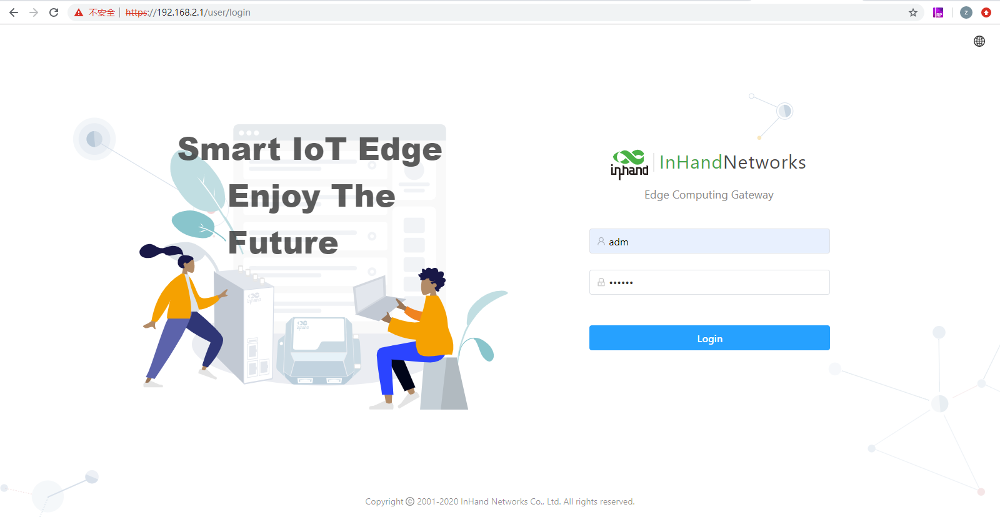   

- Step 3: After successful login, you can see the web page as shown below:   

    

- Step 4: To change the user name and password for logging in to the web management interface of IG902, choose System > User Management page of IG902 and set the new user name and password.   

  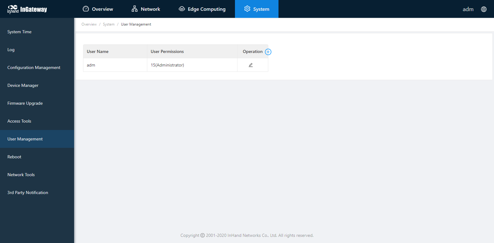  

- Step 5: To change the IP address of GE 0/2, choose Network > Network Interfaces > Ethernet > Gigabitethernet 0/2 page of IG902 to configure GE 0/2.  

    

  

### 1.2 Set WAN Parameters: Connect IG902 to the Internet
  - Method 1: Connect to the Internet by SIM card
    - Step 1: Insert the SIM card. (Note: Before inserting or removing the SIM card, unplug the power cable; otherwise, the operation may cause data loss or damage the IG902.) After inserting the SIM card, connect the 4G LTE antenna to the ANT interface and power on the IG902.  

        

    - Step 2: Choose Network > Network Interfaces > Cellular page of IG902 and select Enable Cellular and click Submit.  

        

      When the network connection status is Connected and an IP address has been allocated, the IG902 has been connected to the Internet with the SIM card.   

        

  - Method 2: Connect to the Internet by Ethernet  
    - Step 1: Use the Ethernet cable to connect the GE 0/1 and GE 0/2 ports of the IG902 respectively, as shown below:   
 
        

    - Step 2: Choose Network > Network Interface > Ethernet > Gigabit Ethernet 0/1 page of IG902 to configure the IP address of the GE 0/1 port and click Submit. (When the network type is a static IP address, you need to configure the IP, subnet mask, and other information according to the site network conditions.)  

        

      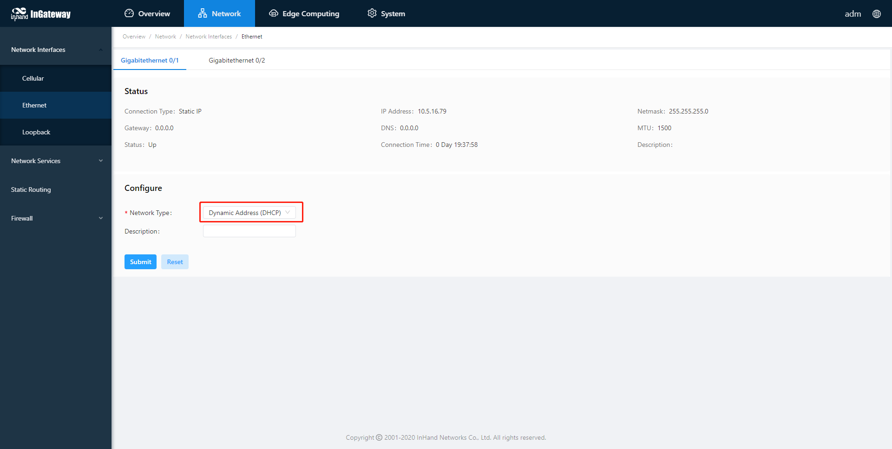  

    - Step 3: Choose Network > Static Routing > Configuration page of IG902 to add a static route for GE 0/1 port and click Submit. (Select "Gigabitethernet 0/1" for the interface item, and configure the other items according to the site network conditions.)  

      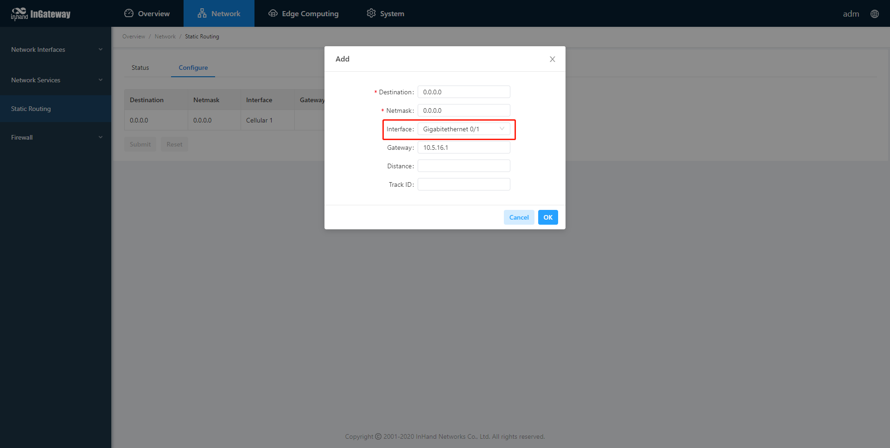  

    - Step 4: Choose System > Network Tools page of IG902 and use the Ping tool to check whether the IG902 has successfully connected to the Internet. The following figure shows that IG902 have successfully connected to the Internet:  

      

  

## 2. Update the Software
To obtain the latest software version of IG902 and updated functions, contact the customer service center. To update the IG902 software version, do as follows:  
- Update the IG902 firmware.  
  
  Choose System > Firmware Upgrade. Select a firmware file and click Start Upgrading. After the update is completed, you are prompted to restart the system to Apply the new firmware.  

    
   
- Upgrade the Python SDK of IG902.   
  
  Choose Edge Computing > Python Edge Computing. Select Python Engine, select an Python SDK file, and click Upgrade; when the upgrade confirmation window pops up, click Confirm. Then the IG902 automatically performs the upgrade.  

  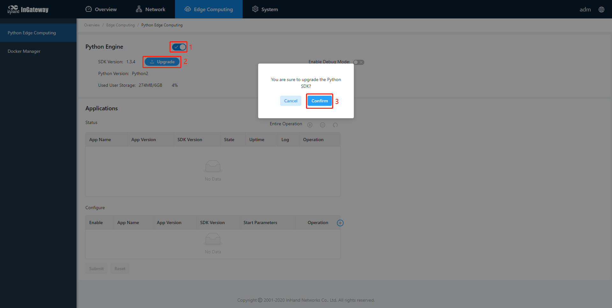  
   
- Upgrade the Docker SDK of IG902.   
  
  Choose Edge Computing > Docker Manager, close the Docker Manager and import the Docker SDK.   

    
   
  After importing, IG902 will automatically install the Docker SDK. The installation process usually takes 1-2 minutes. Please be patient. After successful installation, select Enable Docker Manager and click Submit.  

  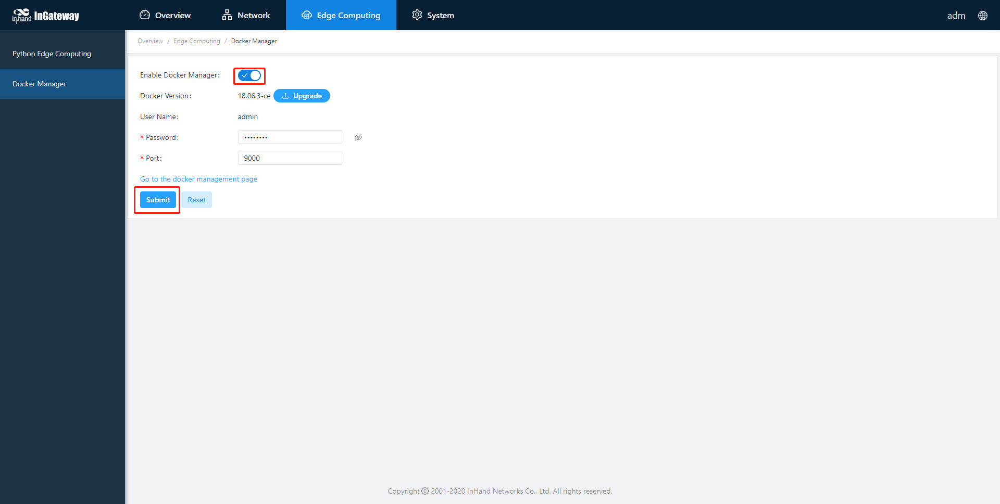  
   
  After enabling the Docker Manager, you can click the access button of the Docker Manager to access the management page.  

    
  
  Enter the account and password set in the figure above to log in to the Docker Manager.  

  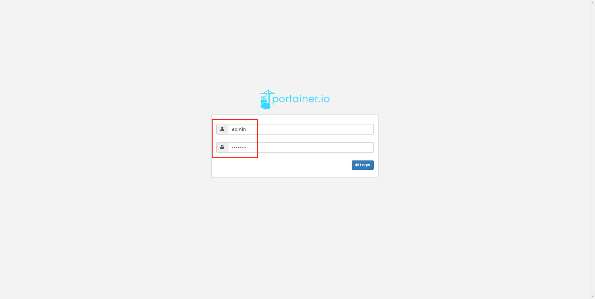

  

## 3. Use Python Edge Computing

  

### 3.1 Install and run Python App
To install and run Python App (App for short) in IG902,  please refer to the following process:
- Step 1: Install the App  
  
  Before installing the App, you need to ensure that the Python Edge Computing Engine is enabled and the Python SDK is installed, as shown in the following figure:  

  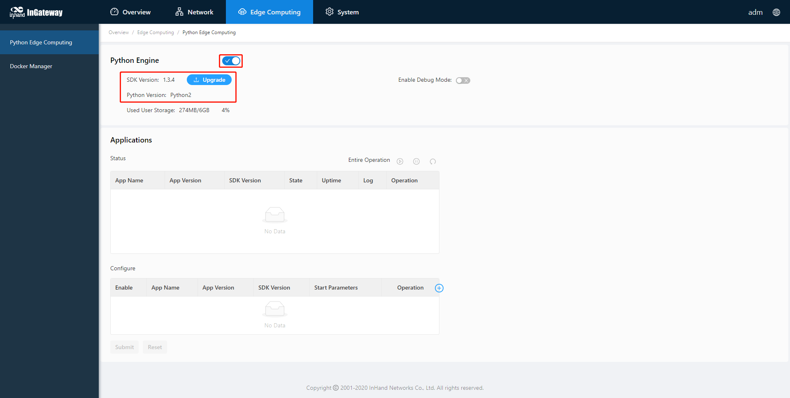  

  Choose Edge Computing > Python Edge Computing. click the Add button and select the App package file to be installed, then click OK.  

  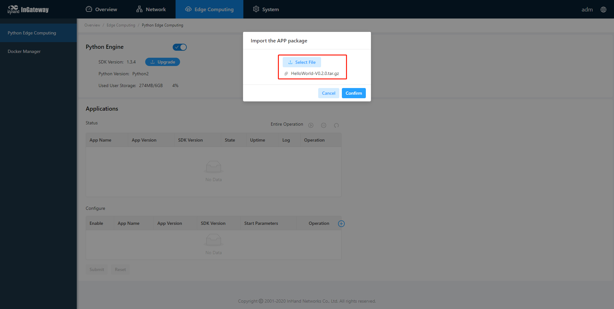  

  After importing, you can view the imported Apps, as shown in the following figure:  

  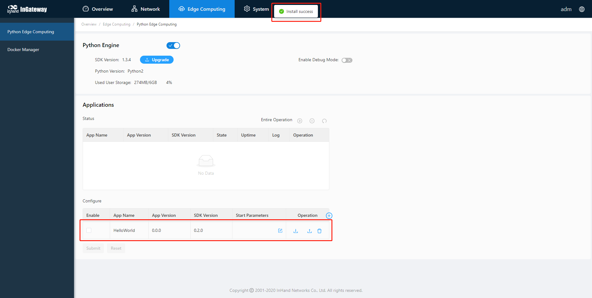  
   
- Step 2: Run the App   
  
  Select enable App and click Submit.  

  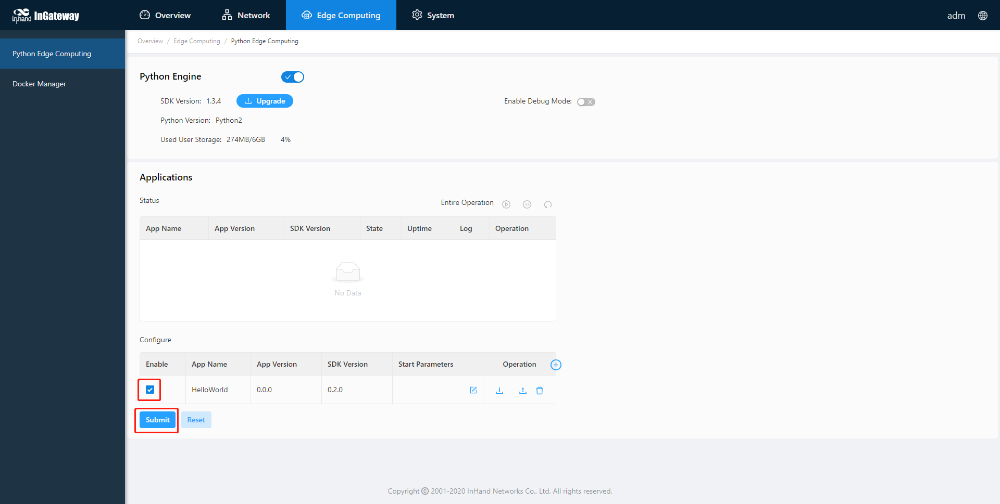  

  Once enabled, the App automatically runs and will run every time the IG902 is started.  

  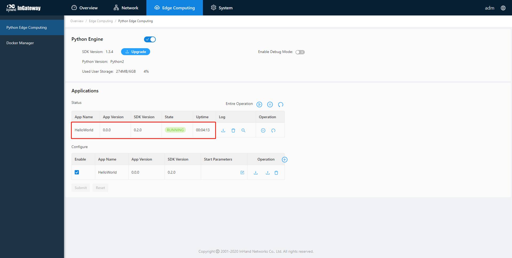

  

### 3.2 Update Configuration File for App
If the installed App supports importing configuration files to modify the running mode, you can update the App running configuration by referring to the following process:
- Step 1: Choose Edge Computing > Python Edge Computing,  click the Import Configuration button and select the configuration file to be imported, then click Confirm.  

    
   
- Step 2: Restart the App after the import is successful. After the App restarts, it will runing according to the imported configuration file.  

  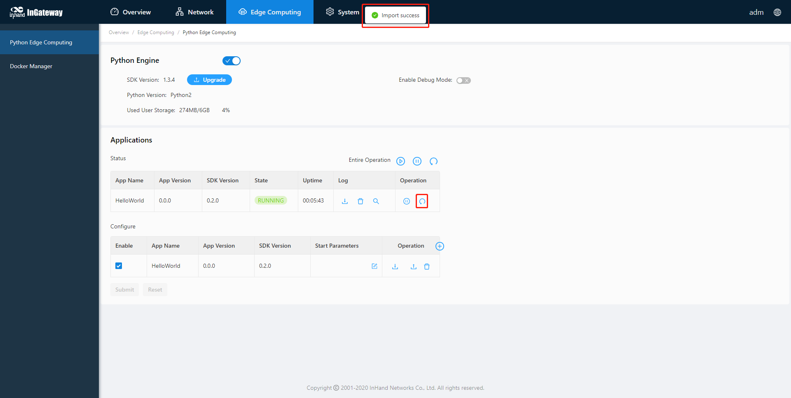  

  

### 3.3 Update Python App version
Generally, if you need to update the Python App version, you only need to import the new version of the App on the Edge Computing > Python Edge Computing page.  

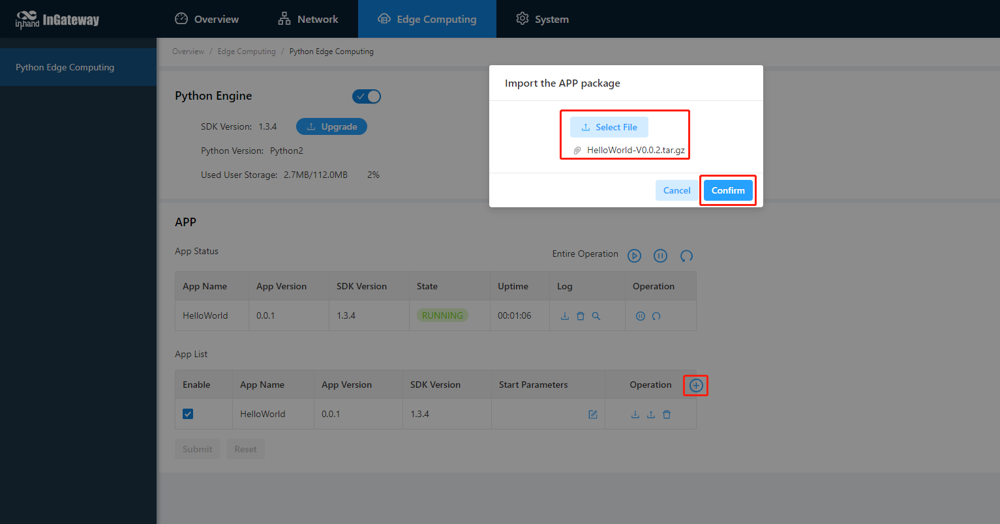  

After the update is completed, as shown below：  

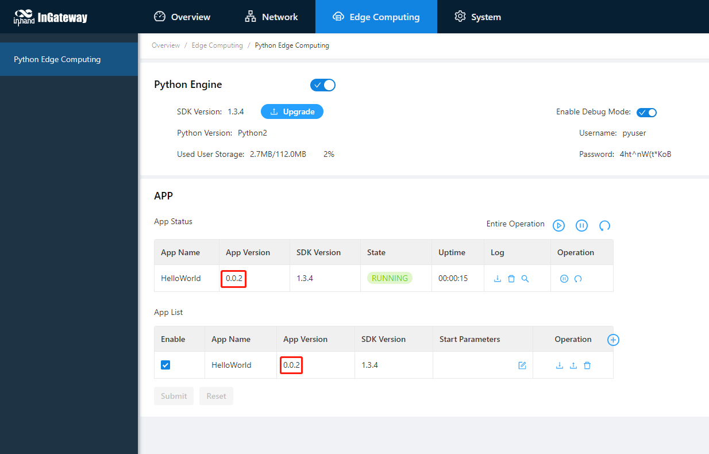

  

### 3.4 Enable the Debug Mode
To run and debug Python code on IG902, you need to enable IG902's debug mode.  Choose Edge Computing > Python Edge Computing, select Enable Debug Mode. After enabling, you can develop IG902 through VS Code. How to use VS Code for Python development of IG902, please refer to [Quick Start for MobiusPi Python Development](http://sdk.ig.inhandnetworks.com/en/latest/MobiusPi%20Python%20QuickStart-EN.html).  

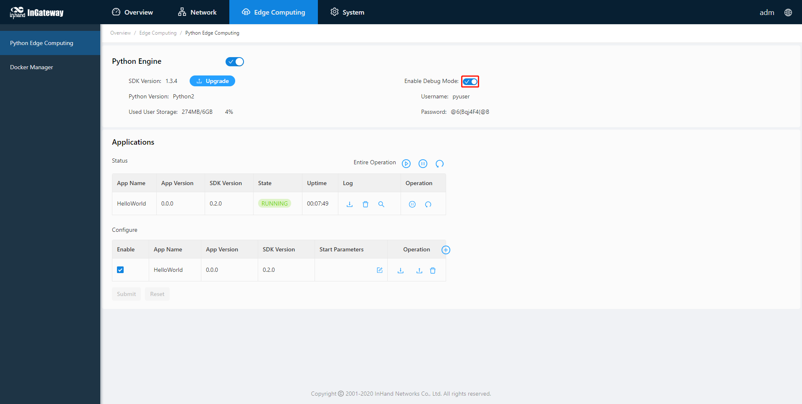  

After the debugging mode is enabled, IG902 will start an SSH server to listen on port 222 of LAN (default IP address being 192.168.2.1). The user name and password of the SSH server are displayed on the previous web page. A random password is generated every time the debugging mode is enabled or the IG902 is restarted to ensure security.

  

## 4. Device Manager
The Device Manager developed by InHand supports functions such as monitoring IG902 status, remote maintenance of equipment, remote batch delivery of IG902 configuration, and IG902 batch upgrade, helping users to conveniently and efficiently manage IG902 and field devices. In order to enable the Device Manager to remotely manage the IG902 and field devices, the IG902 needs to be connected to the cloud platform. The connection method is as follows:  
Choose System Management > Device Manager, tick Enable Device Manager and configure the corresponding server address and registered account, and click Submit after the configuration is complete.  
- Server address: the address of the Device Manager. The address of the Device Manager developed by InHand is as follows:  
  - Domestic version Device Manager：`c.inhandcloud.com`  
  - Overseas version Device Manager：`iot.inhandnetworks.com`  
  - Domestic version InConnect：`ics.inhandiot.com`  
  - Overseas version InConnect：`ics.inhandnetworks.com`  
- Registered account: the Device Manager account associated with the IG902 device (if you have not registered an account, you need to register an account first)  
- Advanced settings: Contains configurations such as heartbeat interval. Generally, you can use the default configuration.  

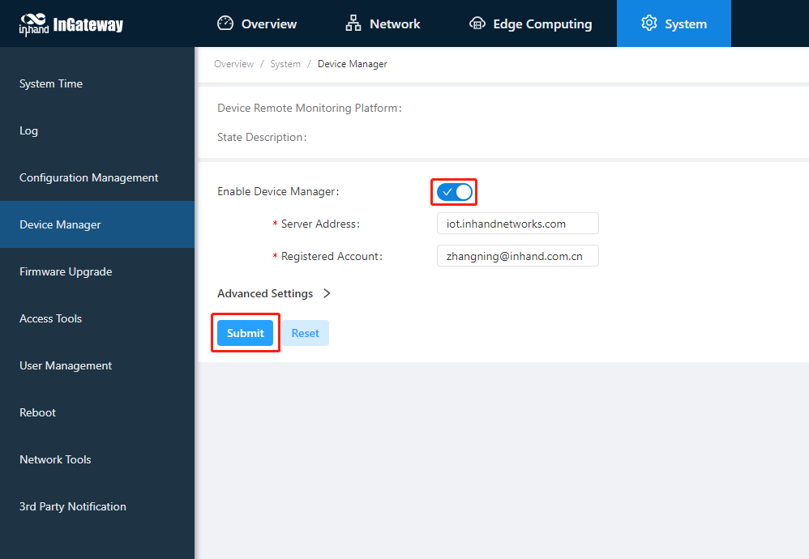   

After the IG902 is successfully connected to the Device Manager, the status is described as Connection Accepted.  

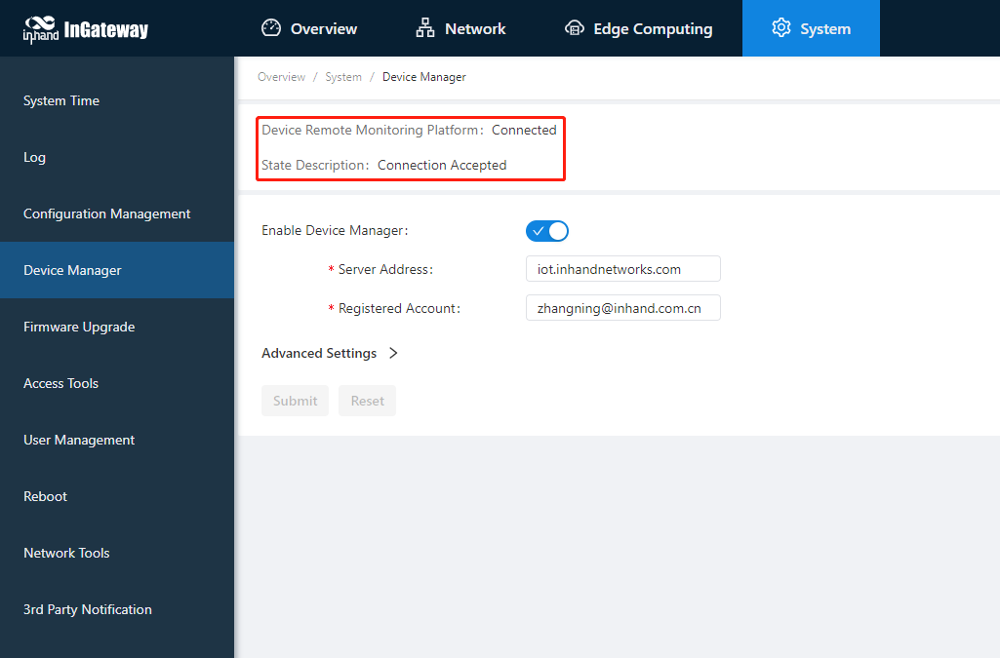  

## Appendix
### Factory reset
There are two ways to restore the IG902 to factory settings: hardware factory reset and software factory reset.
- Hardware factory reset  
  - Step 1: After the device is powered on and the ERR light is off, press and hold the RESET key;  
  - Step 2: When the ERR light is always on, release the RESET key;  
  - Step 3: After the ERR light goes out, press and hold the RESET key again, and release the RESET key when the ERR light flashes; wait for the ERR light to go out, indicating that the factory reset was successful.  
   
- Software factory reset  
  
  Choose System Management > Configuration Management, click the reset button and select OK. IG902 will complete the factory reset operation by itself.  

  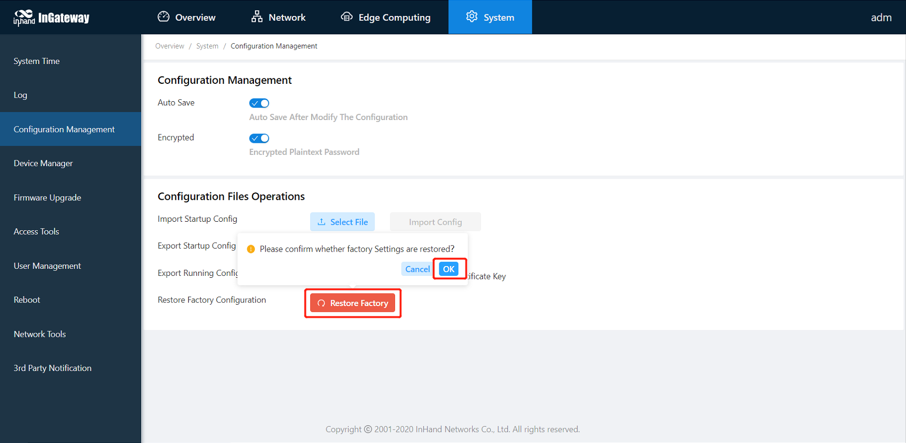