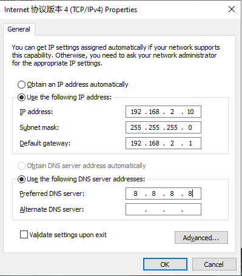
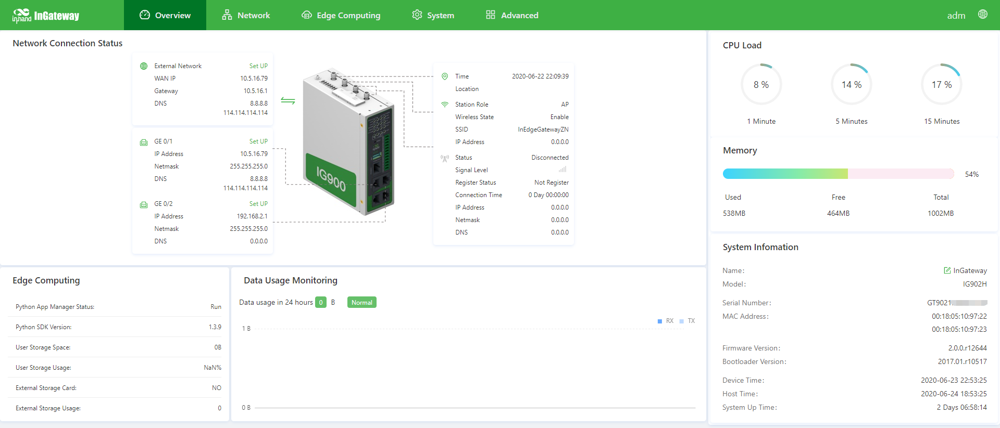
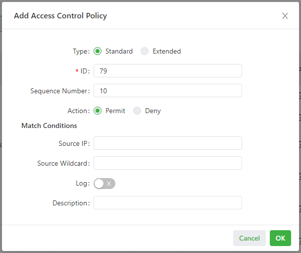
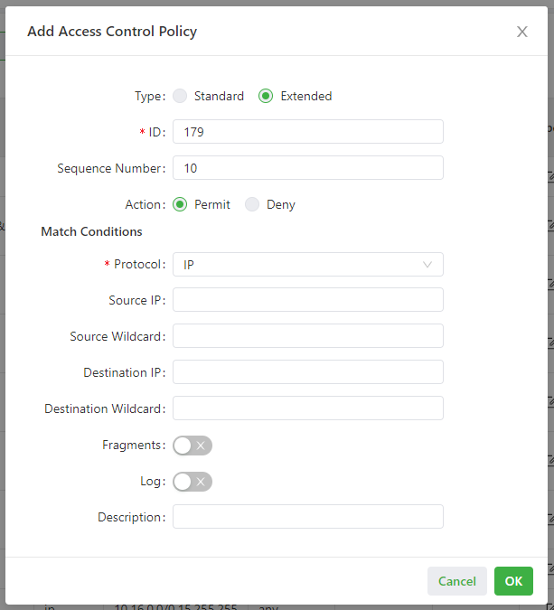

# InGateway902 User Manual

  - [1. Equipment Introduction](#equipment-introduction)
    - [1.1 Overview](#overview)
    - [1.2 Packing List](#packing-list)
    - [1.3 Panel Introduction and Structure Size](#panel-introduction-and-structure-size)
      - [1.3.1 Panel Introduction](#panel-introduction)
      - [1.3.2 Structure Size](#structure-size)
    - [1.4 Panel Indicators](#panel-indicator-description)
      - [1.4.1 LED Indicator](#panel-led-indicator-description)
      - [1.4.2 Signal Status Indicator](#signal-status-indicator-description)
  - [2. Installation](#device-installation)
    - [2.1 Precautions](#installation-precautions)
    - [2.2 Installing and Uninstalling the Device on a DIN-Rail](#guide-rail-installation-and-disassembly)
      - [2.2.1 Installing with a DIN-Rail](#rail-mounting-equipment)
      - [2.2.2 Uninstalling with a DIN-Rail](#rail-type-disassembly-equipment)
    - [2.3 Installing and Uninstalling the Device in Wall-mounted Mode](#wall-mounted-installation-and-disassembly)
      - [2.3.1 Installing in Wall-mounted Mode](#wall-mounted-installation)
      - [2.3.2 Uninstalling in Wall-mounted Mode](#wall-mounted-disassembly)
    - [2.4 Installing a SIM Card](#sim-card-installation)
    - [2.5 Installing an Antenna](#antenna-installation)
    - [2.6 Installing the Power Supply](#power-installation)
    - [2.7 Installing the Ground Protection](#protective-earth-ground-installation)
    - [2.8 Connecting the Network Cable](#network-cable-connection)
    - [2.9 Connecting Terminals](#terminal-connection)
  - [3. Device Configuration Instructions](#device-configuration-instructions)
    - [3.1 Gateway Access](#access-gateway)
    - [3.2 Overview](#overview2)
    - [3.3 Network](#network)
      - [3.3.1 Network Interfaces](#network-interface)
        - [3.3.1.1 Cellular](#cellular-network)
        - [3.3.1.2 Ethernet](#ethernet)
        - [3.3.1.3 WLAN](#wlan)
        - [3.3.1.4 Bridge](#bridge-interface)
        - [3.3.1.5 Loopback](#loopback-interface)
      - [3.3.2 Network Services](#internet-service)
        - [3.3.2.1 DHCP](#dhcp-service)
          - [3.3.2.1.1 DHCP Server](#dhcp-server)
          - [3.3.2.1.2 DHCP Relay](#dhcp-relay)
        - [3.3.2.2 DNS](#dns-service)
        - [3.3.2.3 GPS](#gps)
        - [3.3.2.4 Host List](#host-list)
      - [3.3.3 Routing](#static-routing)
        - [3.3.3.1 Routing Status](#static-routing-status)
        - [3.3.3.2 Static Routing](#static-routing-configuration)
      - [3.3.4 Firewall](#firewall)
        - [3.3.4.1 ACL](#acl)
        - [3.3.4.2 NAT](#nat)
    - [3.4 Edge Computing](#edge-computing)
      - [3.4.1 Python Edge Computing](#python-edge-computing)
      - [3.4.2 Docker Manager](#docker-management)
    - [3.5 System](#system-management)
      - [3.5.1 System Time](#system-time)
      - [3.5.2 Log](#system-log)
      - [3.5.3 Configuration Management](#configuration-management)
      - [3.5.4 Device Manager](#equipment-remote-monitoring-platform)
      - [3.5.5 Firmware Upgrade](#firmware-upgrade)
      - [3.5.6 Access Tools](#management-tools)
      - [3.5.7 User Management](#user-management)
      - [3.5.8 Reboot](#reboot)
      - [3.5.9 Network Tools](#tools)
      - [3.5.10 3rd Party Notification](#third-party-software-statement)
    - [3.6 Navigation Bar Operations](#navigation-bar-operation)
      - [3.6.1 Returning to the Homepage](#back-to-top)
      - [3.6.2 Logging Out](#sign-out)
      - [3.6.3 Changing the Language](#switch-language)
  - [4. Advanced Functions](#advanced-features)
    - [4.1 Administration](#management)
      - [4.1.1 System](#system)
      - [4.1.2 AAA](#aaa)
        - [4.1.2.1 Radius](#radius)
        - [4.1.2.2 Tacacs+](#tacacs)
        - [4.1.2.3 LDAP](#ldap)
        - [4.1.2.4 AAA Settings](#aaa-certification)
      - [4.1.3 Alarm](#alarm)
    - [4.2 Link Backup](#link-backup)
      - [4.2.1 SLA](#sla)
      - [4.2.2 Track Module](#track-module)
      - [4.2.3 VRRP](#vrrp)
      - [4.2.4 Interface Backup](#interface-backup)
    - [4.3 Routing](#route)
      - [4.3.1 Static Routing](#static-route)
      - [4.3.2 Dynamic Routing](#dynamic-route)
        - [4.3.2.1 RIP](#rip)
        - [4.3.2.2 OSPF](#ospf)
        - [4.3.2.3 Filtering Route](#routing-strategy)
      - [4.3.3 Multicast Routing](#multicast-routing)
        - [4.3.3.1 Basic Settings](#basic-settings)
        - [4.3.3.2 IGMP](#igmp)
    - [4.4 VPN](#vpn)
      - [4.4.1 IPsec](#ipsec)
        - [4.4.1.1 IPsec Setting](#ipsec-configuration)
        - [4.4.1.2 IPsec Extension Setting](#ipsec-extension)
      - [4.4.2 GRE](#gre)
      - [4.4.3 L2TP](#l2tp)
        - [4.4.3.1 L2TP Client](#l2tp-client)
        - [4.4.3.2 L2TP Server](#l2tp-server)
      - [4.4.4 OpenVPN](#openvpn)
        - [4.4.4.1 OpenVPN Client](#openvpn-client)
        - [4.4.4.2 OpenVPN Server](#openvpn-server)
      - [4.4.5 Certificate Management](#certificate-management)
    - [4.5 Industrial Interfaces](#industrial-interface)
      - [4.5.1 DTU](#dtu)
        - [4.5.1.1 Serial Port](#serial-port-settings)
        - [4.5.1.2 DTU1](#dtu1)
        - [4.5.1.3 DTU2](#dtu2)
      - [4.5.2 I/O Interfaces](#io-interface)
    - [4.6 Wizards](#quick-guide)
      - [4.6.1 New LAN](#new-lan)
      - [4.6.2 New WAN](#new-wan)
      - [4.6.3 New Cellular](#new-dial)
      - [4.6.4 New IPsec Tunnel](#new-ipsec-tunnel)
  - [5. FAQ](#faq)
    - [5.1 How Do I Restore Factory Settings Through Hardware?](#how-to-restore-factory-settings-through-hardware)

## 1. Product Introduction

### 1.1 Overview

The InGateway902 (IG902 for short) series is a new-generation series of 4G edge computing gateways developed by InHand Networks for the Industrial IoT sector. It provides omnipresent, uninterrupted Internet access over globally deployed 3G or 4G wireless networks and various broadband services. With superb edge computing capability and comprehensive features such as security guarantee and wireless services, the product is able to connect tens of thousands of devices and provide high-speed data channels for IT-based device management.   
The powerful edge computing capability of the IG902 enables it to provide data optimization, real-time response, agile connection, and intelligent analysis at the edge of the IoT. Using IG902 gateways as edge nodes can significantly reduce the data traffic between the data center and on-site devices, and prevent bottlenecks of cloud computing. In addition, the IG902 optimizes the network architecture, and provides higher security, faster response, and more intelligent services.

The following figure shows common application scenarios of the IG902.

### 1.2 Packing List
Each edge computing gateway product is delivered with accessories (such as standard accessories) frequently used at the customer site. Check the received product against the packing list carefully. If any accessory is missing or damaged, contact the InHand sales personnel promptly.  
InHand provides customers with optional accessories based on the characteristics of different sites. For details, see the optional accessories list.
- Standard accessories  
  <table>
      <thead>
          <tr>
              <th>
Accessory
</th>
              <th>Quantity</th>
              <th>
Description
</th>
          </tr>
      </thead>
      <tbody>
          <tr>
              <th>
Gateway
</th>
              <th>
1
</th>
              <th>
Edge computing gateway
</th>
          </tr>
          <tr>
              <th>
Product document
</th>
              <th>
1
</th>
              <th>
Quick installation manual and user manual (Obtained by scanning a QR code)
</th>
          </tr>
          <tr>
              <th>
Guide rail installation accessory
</th>
              <th>
1
</th>
              <th>
Used to fix the gateway
</th>
          </tr>
          <tr>
              <th>
Power terminal
</th>
              <th>
1
</th>
              <th>
7-pin industrial terminal
</th>
          </tr>
          <tr>
              <th>
Network cable
</th>
              <th>
1
</th>
              <th>
1.5 m long
</th>
          </tr>
          <tr>
              <th>
Antenna
</th>
              <th>
1
</th>
              <th>
3G or 4G specification
</th>
          </tr>
          <tr>
              <th>
Product warranty card
</th>
              <th>
1
</th>
              <th>
Warranty period: 1 year
</th>
          </tr>
          <tr>
              <th>
Certificate of conformance
</th>
              <th>
1
</th>
              <th>
Certificate of conformance for the edge computing gateway
</th>
          </tr>
      </tbody>
  </table>   

- Optional accessories  
  <table>
      <thead>
          <tr>
              <th>
Accessory
</th>
              <th>Quantity</th>
              <th>
Description
</th>
          </tr>
      </thead>
      <tbody>
          <tr>
              <th>
AC power cord
</th>
              <th>
1
</th>
              <th>
Power cord for American English Australian or European Standard
</th>
          </tr>
          <tr>
              <th>
Power Adapter
</th>
              <th>
1
</th>
              <th>
12VDC Power Adapter
</th>
          </tr>
          <tr>
              <th rowspan="2">
Antenna
</th>
              <th>
1
</th>
              <th>
Wi-Fi Antenna
</th>
          </tr>
          <tr>
              <th>
1
</th>
              <th>
GPS Antenna
</th>
          </tr>
          <tr>
              <th>
Serial Port
</th>
              <th>
1
</th>
              <th>
Gateway serial port line for debugging
</th>
          </tr>
      </tbody>
  </table>

### 1.3 Panel introduction and Structure and Dimensions

#### 1.3.1 Panel
The panel introduction of IG902 is shown in the figure below (The IG900 series product is applicable to multiple panel appearances, as they have the same installation method. Refer to the actual product during operation.):  

#### 1.3.2 Structure and Dimensions
The structural and dimensions of IG902 are shown in the following figure:  

  

### 1.4 Panel Indicators

#### 1.4.1 LED Indicator
  

  

Note: Two SIM card indicators are provided. The indicator for SIM card 1 is turned on during the startup process and when startup is successful. In the last four situations, the indicator for the used SIM card is turned on. The following figure shows the indicator for SIM card 1.

#### 1.4.2 Signal Status Indicator
  

Signal: 1–9, there might be a signal problem. Check whether the antenna is installed properly and whether the signal quality in the operating area is good.

  

Signal: 10–19, indicating that signal and device operation are normal.

  

Signal: 20–31, indicating good signal.

## 2. Installation

### 2.1 Precautions
- Power supply requirements: 24 V DC (12–48 V DC). Pay attention to the voltage class. The rated current is 0.6 A (1.2–0.3 A).  
- Environment requirements: operating temperature –25°C to 75°C; storage temperature –40°C to 85°C; relative humidity 5% to 95% (non-condensing). The temperature on the device surface may be high. Install the device in a restricted area and assess the surrounding environment.  
- Avoid direct sunlight and keep away from thermal sources or areas with strong electromagnetic interferences.  
- Install the gateway product on an industrial DIN-rail.  
- Check whether the required cables and connectors are installed.

### 2.2 Installing and Uninstalling the Device on a DIN-Rail

#### 2.2.1 Installing with a DIN-Rail
Procedure:
- Step 1: Select an installation place and reserve enough space for installation.  
- Step 2: Insert the upper part of the DIN rail seat onto the DIN rail. Grab the lower end of the device and revolve it upward in the direction indicated by arrow 2 with gentle force, to insert the DIN rail seat onto the DIN rail. Check that the device is installed reliably on the DIN rail, as shown in following figure on the right.
  
  

#### 2.2.2 Uninstalling with a DIN-Rail
Procedure:
- Step 1: Press the device downward in the direction indicated by arrow 1 in following figure to create a gap near the lower end of the device so that the device isolates from the DIN rail.  
- Step 2: Revolve the device in the direction indicated by arrow 2, and grab the lower end of the device and move the device outward. Lift the device when its lower end isolates from the DIN rail. Then, take off the device from the DIN rail.
  
  

### 2.3 Installing and Uninstalling the Device in Wall-mounted Mode

#### 2.3.1 Installing in Wall-mounted Mode
Procedure:
- Step 1: Select an installation place and reserve enough space for installation.  
- Step 2: Install the wall mounting bracket on the back of the device by using a screwdriver, as shown in following figure.  

  

- Step 3: Take out the screws (packaged with the wall mounting bracket), fasten the screws in the installation positions by using the screwdriver, and pull down the device to make it secure, as shown in following figure.
  
  

#### 2.3.2 Uninstalling in Wall-mounted Mode
Procedure: Hold the device with one hand and unfasten the screws that fix the upper end of the device with the other hand, to remove the device from the installation place.

### 2.4 Installing a SIM Card
IG902 supports Dual SIM card. Unfasten the screws on the cover of the SIM card holder by using a screwdriver and insert a SIM card.  

### 2.5 Installing an Antenna
Revolve the movable part of the metal SMAJ interface with gentle force until it cannot be revolved, in which state the outer thread of the antenna connection cable is invisible. Do not wring the antenna with force by grabbing the black plastic cover.  

  

Note:  
- IG902 supports dual antenna: ANT antenna and AUX antenna. The ANT antenna sends and receives data. The AUX antenna only increases the antenna signal strength and cannot be used independently for data transmission.  
- Only the ANT antenna is used in normal cases. It is used with the AUX antenna only when signal is poor and signal strength must be improved.

### 2.6 Installing the Power Supply
Procedure:
- Step 1: Remove the terminal from the gateway.  
- Step 2: Unfasten the locking screw on the terminal.  
- Step 3: Connect the power cable to the terminal and fasten the locking screw.

  

### 2.7 Installing the Ground Protection
Procedure:
- Step 1: Unfasten the ground screw cap.  
- Step 2: Put the ground loop of the cabinet ground cable onto the ground post.  
- Step 3: Fasten the ground screw cap.

Caution: Ground the gateway to improve its interference resistance. Connect the ground cable to the ground post of the gateway based on the operation environment.

### 2.8 Connecting the Network Cable
Connect the gateway to a PC directly by using the Ethernet cable.  

  

### 2.9 Connecting Terminals
Terminals provide the RS232 and RS485 interface modes. Connect cables to the corresponding terminals before using the interfaces. During installation, remove the terminals from the device, unfasten the locking screws on the terminals, connect cables to the corresponding terminals, and fasten the screws. Sort the cables in order.  

  

Note: This section is only applicable to IG902 with industrial interfaces.

## 3. Device Configuration

### 3.1 Gateway Access

- Step 1: Set an IP address for your PC, which is on the same network segment as the IP address of interface GE 0/2 on the IG902. The default IP address of GE 0/2 is **192.168.2.1**.
  
  - Method 1: Enable the PC to obtain an IP address automatically (recommended).
    
    
  
  - Method 2: Use a fixed IP address.  

    Select **Use the following IP address**, enter an IP address (any value between 192.168.2.2 and 192.168.2.254 by default), subnet mask (255.255.255.0 by default), default gateway (192.168.2.1 by default), and DNS server address, and click **OK.**
    
    

- Step 2: Start the browser to visit the IP address of GE 0/2 on the IG902, and enter the user name and password on the login page that appears. The factory default user name and password of the IG902 are **adm** and **123456**, respectively.
  
  

- Step 3: After logging in, you will see the web page as shown in the following figure.
  
  

### 3.2 Overview

The **Overview** page displays information about the IG902, such as its network connection status, system information, and data usage. You can quickly obtain the IG902 running status on this page.   
After you log in to the IG902 web page, the **Overview** page appears by default. You can also click **Overview** to display this page. This page displays the following information:

- Network Connection Status: shows the IG902's network connection status and network configuration.
  
  - External network status: When you click **Set UP**, the [Static Routing](#static-routing) page appears.
  - Network status of GE 0/1: When you click **Set UP**, the [Ethernet](#ethernet) page appears.
  - Network status of GE 0/2: When you click **Set UP**, the [Ethernet](#ethernet) page appears.
  
  

- Edge Computing: shows the status of Python edge computing.
  
  

- Data Usage Monitoring: shows the usage of data traffic in the last 24 hours. One data record is produced every hour.
  
  

- CPU Load: shows the CPU usage in the last 1 minute, 5 minutes, and 15 minutes.
  
  

- Memory: shows the current memory usage.
  
  

- System Information: You can click the Edit icon to change name of the IG902.
  
  

### 3.3 Network

#### 3.3.1 Network Interfaces

##### 3.3.1.1 Cellular

The **Cellular** page displays the configuration and status of the IG902's dial-up interface. You can set dial-up interface parameters to connect the IG902 to a cellular network or view details about the dial-up interface on this page. Follow these steps to configure the dial-up interface:

1. Choose **Network > Network Interfaces > Cellular** to display the **Cellular** page.
2. Select **Enable Cellular**.
3. Set the parameters (default settings recommended). For details about these parameters, see [cellular network parameter description](#cellular-parameter-description).
4. Click **Submit** to complete the configuration of the dial-up interface.

The cellular network parameters are described as follows:

- Enable Cellular: enables or disables the cellular network connection.
- Profile
  - Network Type: specifies the type of the mobile network to which the gateway is connected, which can be GSM or CDMA.
  - APN: specifies the access point name (APN) that identifies the service type of a WCDMA/LTE network. A WCDMA/LTE system provides services based on the APN of the connected WCDMA/LTE network. (This parameter does not need to be set for the CDMA2000 series.)
  - Access Number: specifies the dial string provided by the network operator. Obtain this dial string from your network operator.
    - If your 3G/LTE data card supports WCDMA or LTE, the default dial string is `*99***1#`.
    - If your 3G data card supports CDMA 2000, the default dial string is `#777`.
  - Auth Method
    - Auto: selects an authentication method automatically.
    - PAP: specifies the Password Authentication Protocol, a simple plain-text authentication method implemented through two-way handshakes.
    - CHAP: specifies the Challenge Handshake Authentication Protocol, a security authentication method that verifies message digests through three-way handshakes.
    - MS-CHAP: specifies the CHAP standard defined by Microsoft.
    - MS-CHAPv2: specifies the upgraded version of MS-CHAP, which requires two-way authentication.
  - Username: specifies the user name used for connection to the public data network (PDN). It is provided by your network operator. The default value is `gprs`.
  - Password: specifies the password of the PDN user. It is provided by your network operator. The default value is `gprs`.
- Dual SIM Enable: enables or disables the dual-SIM card mode.
  - Main SIM: specifies the main SIM card used. Options are SIM1, SIM2, Random, and Sequential.
  - Max Number Of Dial: specifies the maximum number of dial-up attempts on SIM1. When the number of dial-up failures reaches this number, the gateway switches to SIM2.
  - Min Connected Time: specifies the minimum network connection duration after the gateway dials up successfully. Within this duration, the number of dial-up attempts is counted. When the connection duration exceeds the set value, the number of dial-up attempts is reset. When the value is set to 0, this function is disabled.
  - Backup SIM Timeout: specifies the timeout period of the backup SIM card used currently. The gateway switches to the main SIM card when the timeout period of the backup SIM card is reached.
- Network Type: specifies a network type for the SIM card. Options are Auto, 3G, 4G, and 2G. You can select a specific network type suitable for your gateway and SIM card or choose the auto mode, in which the gateway automatically registers to the suitable network.
- Profile: specifies the index of the dial-up parameter set.
- Roaming: enables the roaming function to allow the gateway to dial up in roaming state or disables the roaming function to prevent the gateway from dialing up in roaming state. When a local SIM card is used, its dial-up capability is not affected whether this option is selected or deselected.
- PIN code: specifies the personal identification number of the SIM card. If you enable PIN code but do not set a PIN code or set a wrong PIN code, the gateway cannot dial up. A valid PIN code enables the gateway to dial up to a network.
- Static IP: enables or disables the use of a static IP address. If you select this option, specify an IP address manually. Then, the gateway obtains the specified static IP address every time it dials up to a network.
- Connection Mode
  - Always Online: indicates that the gateway stays online when it is running properly and will be disconnected and redial up only if the dial-up interface does not transmit any traffic in 30 minutes. This is the default connection mode of the system.
  - On-demand Dial
    - Data Trigger: indicates that the gateway is offline by default and will dial up automatically when data is sent to the Internet.
  - Manual Dial: indicates that the network connection can be established or terminated by clicking **Connect** or **Disconnect** in the **Status** area.
- Redial Interval: specifies the period that the gateway waits before dialing up again.
- ICMP Probes
  - ICMP Detection Server: specifies the IP address or domain name of the remote ICMP server to be probed. (If two ICMP servers are enabled, it is recommended that you enter the IP addresses or domain names of both servers here.) The gateway supports two ICMP servers: a primary server and a backup server. After two servers are configured, the gateway probes the primary server first. It probes the secondary server only when the number of probe retries on the primary server reaches the maximum value. If both the servers fail to be detected, the gateway dials up again and starts a new round of ICMP probe.
  - ICMP Detection Interval: specifies the interval between ICMP probe packets sent from the gateway.
  - ICMP Detection Timeout: specifies the timeout period of an ICMP probe. If the gateway does not receive any ICMP Reply packet within this period, it considers that the ICMP probe times out.
  - ICMP Detection Max Retries: specifies the maximum number of retries after an ICMP probe failure. (The gateway dials up again when the number of retries reaches this value.)
  - ICMP Detection Strict: enables or disables the strict ICMP probe mode. In this mode, the gateway does not send ICMP probe packets when its dial-up interface is transmitting data traffic. It sends ICMP probe packets only when the dial-up interface is idle.
- Advanced Settings
  - Initial Commands: specifies some AT commands used to check the module status.
  - RSSI Poll Interval: specifies the interval at which the gateway checks the signal status after dialing up successfully. For example, the interval is set to 60s. If you remove the antennas after the gateway dials up successfully, the signal strength will remain unchanged in 60s and decrease 60s later. If the interval is set to 0, RSSI polling is disabled.
  - Dial Timeout: specifies the dial-up timeout period. If the gateway fails to dial up to a network within the timeout period, the dial-up times out. In this case, the gateway checks the module status and dials up to the network again.
  - MRU: specifies the maximum receive unit, which is expressed in bytes.
  - MTU: specifies the maximum transmit unit, which is expressed in bytes.
  - Use Default Asyncmap: enables or disables the default Asyncmap.
  - Use Peer DNS: enables or disables the use of the DNS server assigned in the connected network.
  - LCP Interval: specifies the interval at which the gateway checks whether the cellular connection is normal.
  - LCP Max Retries: specifies the maximum number of dial-up retries after the link connection is interrupted.
  - Infinitely Dial Retry: enables the gateway to retry unlimited times upon a dial-up failure.
  - Debug: enables display of more detailed system logs.
  - Expert Options: allows you to set command parameters.

##### 3.3.1.2 Ethernet

The **Ethernet** page displays the configuration and status of Ethernet interfaces on the IG902. You can set Ethernet interface parameters or view details about the Ethernet interfaces on this page. Follow these steps to configure the Ethernet interfaces:

1. Choose **Network > Network Interfaces > Ethernet** to display the **Ethernet** page and click the **Gigabitethernet 0/1** tab.
2. Select a network type for interface GE 0/1.
3. Select options or enter values for the parameters. For details about these parameters, see [Ethernet parameter description](#ethernet-parameter-description).
4. Click **Submit** to complete the configuration of GE 0/1.
5. Choose **Network > Network Interfaces > Ethernet** to display the **Ethernet** page and click the **Gigabitethernet 0/2** tab. (By default, GE 0/2 is a bridge interface. To configure this interface, you must remove `gigabitethernet 0/2` from the **Bridge** page first.)
6. Select a network type for interface GE 0/2.
7. Select options or enter values for the parameters. For details about these parameters, see [Ethernet parameter description](#ethernet-parameter-description).
8. Click **Submit** to complete the configuration of GE 0/2.

The following figure shows the configuration of GE 0/1, with **Network Type** set to **DHCP**.

The following figure shows the configuration of GE 0/1, with **Network Type** set to **Static IP**.

The following figure shows the configuration of GE 0/2, with **Network Type** set to **Static IP**.

The Ethernet parameters are described as follows:

- Network Type (Static IP by default)
  - Static IP: uses a manually configured IP address, matching subnet mask, and other information for the Ethernet interface.
  - Dynamic Address (DHCP): configures the interface as a DHCP client to obtain an IP address, the matching subnet mask, and other information through DHCP.
- Static IP mode
  - Primary IP: specifies the IP address of the Ethernet interface. By default, the IP address of GE 0/1 is 192.168.1.1, and the IP address of GE 0/2 is 192.168.2.1.
  - Netmask: specifies the subnet mask of the Ethernet interface.
  - MTU: specifies the maximum transmit unit, which is expressed in bytes. The default value is 1500.
  - Speed/Duplex, including:
    - Auto Negotiation
    - 1000M Full Duplex
    - 1000M Half Duplex
    - 100M Full Duplex
    - 100M Half Duplex
    - 10M Full Duplex
    - 10M Half Duplex
  - Track L2 State: enables or disables tracking of L2 interface status. After this feature is enabled, the interface is Down when it is not physically connected and is Up when it is physically connected. After this feature is disabled, the interface state is displayed as UP regardless of whether the interface is physically connected.
  - Shutdown: disables the interface.
  - Description: specifies the descriptive information that identifies the Ethernet interface.
  - Secondary IP Setting: allows you to set up to 10 secondary IP addresses in addition to the primary IP address.
- DHCP mode
  - Description: specifies the descriptive information that identifies the Ethernet interface.

##### 3.3.1.3 WLAN

The **WLAN** page displays the WLAN configuration and status on the IG902. You can set WLAN parameters or view detailed WLAN status information on this page. Follow these steps to configure WLAN parameters:

1. Choose **Network > Network Interfaces > WLAN** to display the **WLAN** page.
2. Select **Enable Wi-Fi**, and then select options or enter values for the parameters. For details about these parameters, see [WLAN parameter description.](#wlan-parameter-description)
3. Click **Submit** to complete the WLAN configuration.

The following figure shows the configuration of the gateway as a wireless access point (AP).

The following figure shows the configuration of the gateway as a wireless client.

The WLAN parameters are described as follows:

- Enable Wi-Fi: enables or disables the Wi-Fi service. After enabling the Wi-Fi service, you can set the basic parameters and security authentication options for the wireless network, so that users can connect to the Internet wirelessly.
- Station Role: specifies the working mode of the gateway, which can be client or AP.
- Client mode
  - Default Route: uses the default route. After you select this option, a wireless route is added automatically.
  - Client SSID: specifies the SSID of the network to be connected.
  - Auth Method: same as the authentication method used on the network to be connected.
  - Encrypt Mode: same as the encryption method used on the network to be connected.
  - WPA/WPA2 PSK Key: same as the key used on the network to be connected.
  - Network Type: same as the type of the network to be connected.
- AP mode
  - SSID Broadcast: enables SSID broadcasting to allow wireless clients to discover this SSID or disables SSID broadcasting to hide this SSID. When the SSID is hidden, beacon frames sent from the AP do not contain the SSID. In this case, a wireless client can connect to the AP only after the SSID is manually specified on the client.
  - AP Isolate: enables or disables client isolation on the AP. After this feature is enabled, the AP does not forward L2 packets between the clients connected to it.
  - Bridge: enables or disables bridging of the radio interface to the bridge interface.
  - Band: specifies the frequency band used by the AP. The gateway supports 2.4 GHz and 5 GHz bands.
  - Radio Type: specifies the radio type of the AP. The AP supports six radio types: 802.11g/n, 802.11g, 802.11n, 802.11b, 802.11b/g, and 802.11b/g/n.
    - 802.11b: works at the 2.4 GHz band, with the maximum rate of 11 Mbit/s.
    - 802.11g: works at the 2.4 GHz band, with the maximum rate of 54 Mbit/s.
    - 802.11n: works at the 2.4 GHz or 5 GHz band, with the maximum theoretical rate of 300 Mbit/s.
  - Channel: specifies a data transmission channel that uses wireless signals as the transmission medium. The AP provides 13 channels with different carrier frequencies.
    - The center frequency of channel 1 is 2.412 GHz.
    - The center frequency of channel 2 is 2.417 GHz.
    - The center frequency of channel 3 is 2.422 GHz.
    - The center frequency of channel 4 is 2.427 GHz.
    - The center frequency of channel 5 is 2.432 GHz.
    - The center frequency of channel 6 is 2.437 GHz.
    - The center frequency of channel 7 is 2.442 GHz.
    - The center frequency of channel 8 is 2.447GHz.
    - The center frequency of channel 9 is 2.452 GHz.
    - The center frequency of channel 10 is 2.457 GHz.
    - The center frequency of channel 11 is 2.462 GHz.
    - The center frequency of channel 12 is 2.467 GHz.
    - The center frequency of channel 13 is 2.472 GHz.
  - SSID: specifies the service set identifier of the AP. The SSID technology allows a WLAN to be divided into multiple sub-networks that require separate identity authentication. Users can connect to a sub-network only after passing the identity authentication of the sub-network. This prevents access from unauthorized users.
  - Auth Method: specifies the authentication method used by the AP. The AP supports five authentication methods: open authentication, shared key authentication, WPA-PSK, WPA2-PSK, and WPAPSK/WPA2PSK. The last three authentication methods are implemented by using encrypted data.
  - Encrypt Mode: specifies the encryption mode used for authentication. The AP supports TKIP and AES encryption modes.
  - WPA/WPA2 PSK Key: specifies the authentication key, which contains 8-63 characters.
  - Bandwidth: specifies the channel bandwidth on the working band of the AP. Options are 20MHz and 40MHz.
  - Stations Limit: specifies the maximum number of clients supported by the AP (a maximum of 128).
  - IP Address: specifies the IP address of the radio interface. (This parameter is unavailable after the bridge interface is enabled.)
  - Netmask: specifies the subnet mask of the radio interface. (This parameter is unavailable after the bridge interface is enabled.)

##### 3.3.1.4 Bridge

The bridge interface is a logical, virtual interface on the IG902. You can bridge the radio interface with interface GE 0/2. (If `Station Role` is set to `client` on the `WLAN` page, the radio interface cannot be selected as a bridge member.) Follow these steps to configure the bridge interface:

1. Select members of the bridge interface.
2. Set parameters for the bridge interface. For details about these parameters, see [bridge interface parameter description](#bridge-interface-parameter-description).
3. Click **Submit** to save the configuration.

As shown in the following figure, the radio interface is bridged with interface GE 0/2.

The bridge interface parameters are described as follows:

- Primary IP: specifies the primary IP address of the bridge interface.
- Netmask: specifies the subnet mask of the bridge interface.
- Secondary IP Setting: allows you to set up to 10 secondary IP addresses in addition to the primary IP address.
- Bridge Member
  - dot11radio 1: specifies the radio interface.
  - gigabitethernet 0/2: specifies interface GE 0/2.

##### 3.3.1.5 Loopback

The loopback interface is a logical, virtual interface on the IG902. After you create and configure the loopback interface, you can ping its IP address or set up a Telnet connection to it to test the network connectivity. You can set or view loopback interface parameters on the **Loopback** page. Follow these steps to configure the loopback interface:

1. Choose **Network > Network Interfaces > **Loopback**** to display the **Loopback** page. You can set or view loopback interface parameters on this page.
2. Click the Add icon in the table under **Secondary IP Setting** to add a secondary IP address for the loopback interface. (The default IP address is 127.0.0.1.)
3. Enter the secondary IP address and subnet mask.
4. Click **Submit** to complete the configuration of the loopback interface.

As shown in the following figure, a secondary IP address 127.0.0.2 is set for the loopback interface. 

Caution: You can set a maximum of 10 secondary IP addresses for the loopback interface.

#### 3.3.2 Network Services

##### 3.3.2.1 DHCP

###### 3.3.2.1.1 DHCP Server

The Dynamic Host Configuration Protocol (DHCP) uses the client/server communication model. The client sends a configuration request to the server, and the server replies with the IP address allocated to the client and other configuration information. In this way, the client IP address and other configuration is assigned dynamically. You can configure a DHCP server and view its configuration on the **DHCP Server** page. Follow these steps to configure a DHCP server:

1. Choose **Network > Network Services > DHCP > DHCP Server** to display the **DHCP Server** page.
2. Click the **Add** or **Edit** icon to configure the DHCP server.
3. Set the parameters. For details about these parameters, see [DHCP server parameter description](#dhcp-server-parameter-description).
4. Click **OK** to save the configuration, and then click **Submit** to apply the configuration.

The following figure shows the DHCP server configuration.

- The DHCP server parameters are described as follows:
  
  - Enable DHCP Service: enables or disables the DHCP service. Caution: The DHCP server and DHCP relay features cannot be enabled at the same time.
  - Interface: specifies the interface on which the DHCP service is enabled. You can select Gigabitethernet 0/1, Gigabitethernet 0/2, Bridge 1, or Dot11radio 1. Interfaces Bridge 1 and Dot11radio 1 are available only on the Wi-Fi-capable IG902.
  - Starting Address: specifies the start IP address of the IP address pool for address allocation to DHCP clients.
  - Ending Address: specifies the end IP address of the IP address pool for address allocation to DHCP clients.
  - Lease: specifies the validity period of allocated IP addresses. The DHCP server will reclaim the expired IP addresses for reallocation. This field cannot be left blank.

- Windows Name Server (WINS): specifies the IP address of the WINS server.

- Static IP Setting: allows you to bind a fixed IP address to a MAC address, as shown in the following figure.
  
  

###### 3.3.2.1.2 DHCP Relay

A DHCP relay (or DHCP relay agent) can process and forward DHCP information between subnets and physical network segments. You can configure a DHCP relay and view its configuration on the **DHCP Relay** page. Follow these steps to configure a DHCP relay:

1. Choose **Network > Network Services > DHCP > DHCP Relay** to display the **DHCP **Relay**** page.
2. Enable the DHCP relay feature. Before this operation, you must disable the DHCP server.
3. Specify the DHCP server addresses and relay interface. For details about these parameters, see [DHCP relay parameter description](#dhcp-relay-parameter-description).
4. Click **Submit** to apply the configuration.

The following figure shows the DHCP relay configuration.

The DHCP relay parameters are described as follows:

- Enable DHCP Relay: enables or disables the DHCP relay feature. The DHCP relay and DHCP server features cannot be enabled at the same time.
- DHCP Server: specifies the IP address of the DHCP server.
- Relay Interface: specifies the network interface that serves as the DHCP relay.

##### 3.3.2.2 DNS

A domain name system (DNS) is a distributed database used for TCP/IP applications and provides translation between domain names and IP addresses. DNS allows users to access some applications by using easy-to-remember, meaningful domain names, which are then translated into the correct IP addresses by a DNS server on the network. You can configure a DNS server and the DNS relay service and view the configuration on the **DNS** page.

- Follow these steps to configure a DNS server:
  
  1. Choose **Network > Network Services > DNS** to display the **DNS** page.
  2. Enter the IP address of the DNS server.
  3. Click **Submit** to apply the configuration.
  
  The following figure shows the DNS server configuration.
  
  

- Follow these steps to configure the DNS relay service:
  
  1. Choose **Network > Network Services > DNS** to display the **DNS** page.
  2. Enable the DNS relay service. The DNS relay service cannot be disabled when the DHCP server feature is enabled.
  3. Click the Add icon to add a **[domain name \<=> IP address] pair**.
  4. Enter the domain name or IP address of a host and specify the matching IP address.
  5. Click **OK** to save the configuration, and then click **Submit** to apply the configuration.
  
  The following figure shows the configuration of the DNS relay service.
  
  

##### 3.3.2.3 GPS

On the **GPS** page, you can enable or disable the GPS service, view the IG902 location information, and configure IP forwarding and serial forwarding for GPS. The IG902 can act as a GPS client or server for IP forwarding. Choose **Network > Network Services > GPS** to display the **GPS** page.

Follow these steps to configure GPS forwarding:

1. In the **Configure** area, select **Enable GPS**.
2. Select **Enable** under **GPS IP Forwarding** or **GPS Serial Forwarding**.
3. Configure the parameters. For details about these parameters, see [GPS IP forwarding parameter description](#gps-ip-parameter-description) and [GPS serial forwarding parameter description.](#gps-serial-parameter-description) (The GPS serial forwarding and DTU features cannot be used at the same time. Therefore, you must disable DTU before enabling GPS serial forwarding.)
4. Click **Submit** to save the configuration.

The following figure shows the configuration of GPS IP forwarding.

The following figure shows the configuration of GPS serial forwarding.

The parameters of GPS IP forwarding are described as follows:

- Enable: enables or disables GPS IP forwarding.
- Type: specifies the type of GPS IP forwarding.
  - Client
    - Transmit Protocol: specifies the transmission protocol used. Options are TCP and UDP.
    - Connection Type: specifies the type of the transmission connection. Options are Long-Lived and Short-Lived. The setting must be the same as that on the server.
    - Keepalive Interval: specifies the interval at which the gateway sends heartbeat packets over the TCP connection established.
    - Keepalive Retry: specifies the number of heartbeat packet retransmissions upon a heartbeat timeout. If the heartbeat does not resume after heartbeat packets are retransmitted for the specified number of times, the gateway terminates the TCP connection.
    - Min Reconnect Interval: specifies the connection interval at the beginning of TCP connection setup. The interval increases every 30 seconds until it reaches the maximum value.
    - Max Reconnect Interval: specifies the maximum retry interval for TCP connection setup.
    - Source Interface: specifies the interface of which the IP address is used by the gateway to establish a TCP connection to the server.
    - Reporting Interval: specifies the interval at which the gateway reports GPS data.
    - Include RMC: specifies whether the GPS data sent from the gateway includes PMC data.
    - Include GSA: specifies whether the GPS data sent from the gateway includes GSA data.
    - Include GGA: specifies whether the GPS data sent from the gateway includes GGA data.
    - Include GSV: specifies whether the GPS data sent from the gateway includes GSV data.
    - Message Prefix: specifies the user-defined content in the headers of GPS messages sent from the gateway.
    - Message Suffix: specifies the user-defined content at the end of GPS messages sent from the gateway.
  - Server
    - Connection Type: specifies the type of the transmission connection. Options are Long-Lived and Short-Lived. The connection type must be the same as that on the client.
    - Keepalive Interval: specifies the interval at which the gateway sends heartbeat packets over the TCP connection established.
    - Keepalive Retry: specifies the number of heartbeat packet retransmissions upon a heartbeat timeout. If the heartbeat does not resume after heartbeat packets are retransmitted for the specified number of times, the gateway terminates the TCP connection.
    - Local Port: specifies the service port number used by the gateway when it serves as a TCP server.
    - Reporting Interval: specifies the interval at which the gateway reports GPS data.
    - Include RMC: specifies whether the GPS data sent from the gateway includes PMC data.
    - Include GSA: specifies whether the GPS data sent from the gateway includes GSA data.
    - Include GGA: specifies whether the GPS data sent from the gateway includes GGA data.
    - Include GSV: specifies whether the GPS data sent from the gateway includes GSV data.
    - Message Prefix: specifies the user-defined content in the headers of GPS messages sent from the gateway.
    - Message Suffix: specifies the user-defined content at the end of GPS messages sent from the gateway.

Parameters of GPS serial forwarding are described as follows:

- Enable: enables or disables GPS serial forwarding.
- Serial Type: same as that on the remote end (RS232 or RS485).
- Baudrate: same as that on the remote end.
- Data Bits: same as that on the remote end.
- Parity: same as that on the remote end.
- Stop Bit: same as that on the remote end.
- Software Flow Control: enables or disables software flow control.
- Include RMC: specifies whether the GPS data sent from the gateway includes PMC data.
- Include GSA: specifies whether the GPS data sent from the gateway includes GSA data.
- Include GGA: specifies whether the GPS data sent from the gateway includes GGA data.
- Include GSV: specifies whether the GPS data sent from the gateway includes GSV data.

##### 3.3.2.4 Host List

You can view information about hosts connected to the IG902 on the **Host List** page. Choose **Network > Network Services > Host List** to display the **Host List** page, as shown in the following figure.

#### 3.3.3 Routing

##### 3.3.3.1 Routing Status

Choose **Network > Routing > Routing Status** to display the **Routing Status** page. This page displays information about static routes configured on the IG902, as shown in the following figure.

##### 3.3.3.2 Static Routing

You can configure static routes on the **Static Routing** page. Then, packets sent to a specific destination are forwarded through the specified route. (Generally, you do not need to configure static routes.) Follow these steps to configure a static route:

1. Choose **Network > Routing > Static Routing** to display the **Static Routing** page.
2. Click the **Add** icon to add a static route.
3. Set the parameters. For details about these parameters, see [static routing parameter description.](#static-routing-parameter-description)
4. Click **OK** to save the configuration, and then click **Submit** to apply the configuration.

The following figure shows the configuration of a static route.

Parameters of a static route are described as follows:

- Destination: specifies the destination IP address to which packets are sent.
- Netmask: specifies the subnet mask of the destination IP address.
- Interface: specifies the interface through which data packets are forwarded to the destination network.
- Gateway: specifies the IP address of the next router that data packets pass through before reaching the destination IP address.
- Distance: specifies the priority of the route. A smaller value indicates a higher priority.
- Track ID: specifies the track index or ID.

#### 3.3.4 Firewall

##### 3.3.4.1 ACL

An access control list (ACL) permits or denies specified data flows (such as the data flow from a specified source IP address or account) based on a series of matching rules to filter the data reaching a network interface. You can configure a data filtering policy for a network interface on the **ACL** page. The configuration procedure is as follows:

1. Choose **Network > Firewall > ACL** to display the **ACL** page.
2. Click the Add icon under **Access Control Policy** to add an access control policy.
3. Set the parameters. For details about these parameters, see [access control policy parameter description.](#access-control-strategy-parameter-description)
4. Click the Add or Edit icon under **ACL** to add an access control list on a specified interface.
5. Set the parameters. For details about these parameters, see [access control list parameter description.](#access-control-list-parameter-description)
6. Click **OK** to save the configuration, and then click **Submit** to apply the configuration.

The following figure shows the configuration of a standard access control policy.

The following figure shows the configuration of an extended access control policy.

The following figure shows the configuration of an access control list.

- Parameters of a standard access control policy are described as follows:
  
  - ID: specifies the ID of an ACL rule, in the range of 1-99. A smaller value indicates a higher priority of the rule.
  - Sequence Number: specifies the sequence number of the ACL rule. A smaller value indicates a higher priority of the rule.
  - Action: permits or denies forwarding of matching packets.
  - Source IP: specifies the source IP address of packets in the ACL rule. If this field is kept blank, the rule matches packets from all networks.
  - Source Wildcard: specifies the wildcard mask of the source IP address in the ACL rule.
  - Log: enables or disables recording of access control logs.
  - Description: records meanings of access control parameters.

- Parameters of an extended access control policy are described as follows:
  
  - ID: specifies the ID of an ACL rule, in the range of 100-199. A smaller value indicates a higher priority of the rule.
  - Sequence Number: specifies the sequence number of the ACL rule. A smaller value indicates a higher priority of the rule.
  - Action: permits or denies forwarding of matching packets.
  - Protocol: specifies the access control protocol.
  - Source IP: specifies the source IP address of packets in the ACL rule. If this field is kept blank, the rule matches packets from all networks.
  - Source Wildcard: specifies the wildcard mask of the source IP address in the ACL rule.
  - Source Port: specifies the source port number of packets. The value **any** indicates that TCP/UDP packets with any source ports match the rule. This parameter is available only when the TCP or UDP protocol is selected.
  - Destination IP: specifies the destination IP address of packets in the ACL rule. If this field is kept blank, the rule matches packets destined for all networks.
  - Destination Wildcard: specifies the wildcard mask of the destination IP address in the ACL rule.
  - Destination Port: specifies the destination port number of packets. The value **any** indicates that TCP/UDP packets with any destination ports match the rule. This parameter is available only when the TCP or UDP protocol is selected.
  - Established Connection: specifies the range of TCP packets controlled. If this option is selected, the system controls TCP packets on established connections and does not control those on unestablished connections. If this option is deselected, the system controls TCP packets on both established and unestablished connections. This parameter is available only when the TCP protocol is selected.
  - Fragments: enables or disables control of fragmented data packets sent from the interface.
  - Log: enables or disables recording of access control logs.
  - Description: records meanings of access control parameters.

- Parameters of an access control list are described as follows:
  - Interface: specifies the name of the interface on which the access control policy is configured.
  - Rule: specifies the inbound, outbound, and administrative rules.

##### 3.3.4.2 NAT

Network address translation (NAT) allows multiple hosts in a LAN to connect to the Internet by using one or multiple public IP addresses. This feature maps a few public IP addresses to many private IP addresses to conserve public IP addresses. You can view and configure NAT rules on the **NAT** page. The configuration procedure is as follows:

1. Choose **Network > Firewall > NAT** to display the **NAT** page.
2. Select an interface from the **Interface** drop-down list.
3. Click the Add icon under **Network Address Translation (NAT) Rules** to add an NAT rule and set parameters for the rule. For details about these parameters, see [NAT rule parameter description](#network-address-translation-rules-parameter-description).
4. Click **OK** to save the configuration, and then click **Submit** to apply the configuration.

As shown in the following figure, the NAT rule allows hosts connected to the IG902 to connect to the Internet by using the IP address of interface GE 0/2.

Parameters of the NAT rule are described as follows:

- Action
  - SNAT: uses the source network address translation feature that translates source IP addresses of data packets into another IP address. Generally, this feature is used for data packets sent to the Internet through the router.
  - DNAT: uses the destination network address translation feature that translates destination IP addresses of data packets into another IP address. Generally, this feature is used for data packets sent to the private network through the router.
  - 1:1NAT: uses one-to-one IP address translation.
- Source Network (available when the action is set to SNAT or DNAT):
  - Inside: translates private IP addresses.
  - Outside: translates public IP addresses.
- Translation Type, which can be:
  - IP to IP
  - IP to INTERFACE
  - IP PORT to IP PORT
  - ACL to INTERFACE
  - ACL to IP
- Access Control List (unavailable for 1:1 NAT): specifies the ACL rule used to match the packets of which the IP addresses are translated.
- Translated Address (unavailable for 1:1 NAT): specifies the IP address or interface translated from the source address.
- Description: specifies the description of the NAT rule.

### 3.4 Edge Computing

#### 3.4.1 Python Edge Computing

The **Python Edge Computing** page displays information about the Python secondary development environment on the IG902, as well as the configuration and running status of Python apps on the IG902. You can use the secondary development environment to develop custom Python apps, and set or view app status.   
Follow these steps to configure the Python secondary development environment:

1. Choose **Edge Computing > **Python Edge Computing**** to display the **Python Edge Computing** page.
2. Enable the Python edge computing engine.
3. Install or upgrade the Python SDK (optional).
4. Enable the debugging mode. For details about Python secondary development, see [Python Development Quick Start](http://sdk.ig.inhandnetworks.com/en/latest/MobiusPi-Python-QuickStart-EN.html).

Follow these steps to configure a Python app:

1. Choose **Edge Computing > **Python Edge Computing**** to display the **Python Edge Computing** page.
2. Enable the Python edge computing engine.
3. Install or upgrade the Python SDK (optional).
4. In the **Configure** area, import the app package and select **Enable.** For details about the configuration, see [app configuration function description](#app-configuration-function-description).
5. Click **Submit** to apply the configuration.

The following figure shows the configuration of the Python development environment on the IG902.

The following figure shows the app running status (HelloWorld as an example).

The app configuration functions are described as follows:

- App status
  - Start all: starts all the enabled apps.
  - Stop all: stops all the enabled apps.
  - Restart all: restarts all the enabled apps.
  - Download: downloads running logs of a specified app.
  - Delete: deletes all running logs of a specified app.
  - View: displays running logs of a specified app.
  - Stop: stops a specified app.
  - Restart: restarts a specified app.
- App List
  - Enable: enables an app so that it will run automatically after each system reboot.
  - Start Parameters: allows you to configure app start parameters here.
  - Export: allows you to export an app configuration file.
  - Import: allows you to import an app configuration file. After you import a configuration file and restart the app, the app runs with the imported configuration file.
  - Unload: allows you to unload an app.
  - Add: allows you to add an app.

#### 3.4.2 Docker Manager

The IG902 supports hosting of Docker images. You can release your Docker images on the IG902 to deploy and run self-developed applications quickly.   
Follow these steps to configure a Docker environment:

1. Install the Docker SDK.
2. Enable the Docker manager.
3. Configure Docker images and containers on the Docker management page (Portianer).

As shown in the following figure, the Docker manager is enabled.

Parameters on the Docker management page are described as follows:

- Enable Docker Manager: enables or disables the Docker Manager.
- Docker Version: allows you to install or upgrade a Docker version.
- User Name: specifies the user name used to log in to the Portianer.
- Password: specifies the password used to log in to the Portianer.
- Port: specifies the port number used to access the Portianer. The default port number is 9000.
- Docker Image: allows you to import a Docker image.

### 3.5 System

#### 3.5.1 System Time

To enable the IG902 to cooperate with other devices properly, you may need to set an accurate system time for it. For this purpose, set the system time on the **System Time** page and enable the NTP protocol to implement clock synchronization among all clock-supporting devices on the network. In this way, all devices maintain the same clock to provide applications based on the consistent time. Follow these steps to set the system time:

- Method 1: Select a time zone.
  1. Choose **System > System Time** to display the **System Time** page.
  2. Select the time zone where the IG902 is located from the **Time Zone** drop-down list.
  3. Click **Apply**.
- Method 2: Set the system time manually.
  1. Choose **System > System Time** to display the **System Time** page.
  2. Set a specific time in the Set Time field.
  3. Click **Apply**.
- Method 3: Use the local time of the PC.
  1. Choose **System > System Time** to display the **System Time** page.
  2. The IG902 can obtain the time of the PC as its local time.
  3. Click **Sync** next to the Device Time field.
- Method 4: Enable SNTP clients.
  1. Choose **System > System Time** to display the **System Time** page.
  2. Select **Enable SNTP Clients**.
  3. Set the parameters. For details about these parameters, see [SNTP client parameter description.](#sntp-client-parameter-description)
  4. Click **Submit** to apply the configuration.

Follow these steps to enable the NTP server to synchronize time to other devices.

1. Choose **System > System Time** to display the **System Time** page.
2. Select **Enable SNTP Server**.
3. Set the parameters. For details about these parameters, see [NTP server parameter description](#ntp-server-parameter-description).
4. Click **Submit** to apply the configuration.

The following figure shows how to select a time zone or set a system time manually.

The following figure shows how to enable SNTP clients.

The following figure shows how to enable the NTP server to synchronize time to other devices.

SNTP client parameters are described as follows:

- Enable SNTP Clients: enables or disables SNTP clients. If the cellular interface is selected as the source interface, the SNTP service will not be enabled when the gateway fails to dial up to a network.
- Update Interval: specifies the interval at which the SNTP clients synchronize time with the IG902.
- Source Interface: specifies the interface through which the IG902 sends SNTP packets. The source interface and source address cannot be used at the same time.
- Source Address: specifies the source address of the SNTP packets sent from the IG902. The source interface and source address cannot be used at the same time.
- SNTP Servers List
  - Server Address: specifies the domain name or IP address of an SNTP server. You can add a maximum of 10 servers to the list. If you set multiple SNTP servers, the system polls all the SNTP servers to find an available one.
  - Port: specifies the SNTP port number used by an SNTP server.

The NTP server parameters are described as follows:

- Enable NTP Server: enables or disables the NTP server feature.
- Update Interval: specifies the time synchronization interval. The NTP protocol uses the multi-stratum synchronization model. Generally, stratum-n+1 clocks synchronize with a stratum-n clock source. NTP supports synchronization of up to 16 strata of clocks, namely, stratum 0 to stratum 15. Synchronization cannot be implemented for more than 16 strata of clocks.
- Source Interface: specifies the interface through which the IG902 sends NTP packets. The source interface and source address cannot be used at the same time.
- Source Address: specifies the source address of the SNTP packets sent from the IG902. The source interface and source address cannot be used at the same time.
- NTP Servers List
  - Primary NTP Server: specifies the primary NTP server from which the IG902 synchronizes time. If you select multiple primary NTP servers, the IG902 polls all the selected servers to find an available one.
  - Server Address: specifies the domain name or IP address of an NTP server. You can add a maximum of 10 servers to the list.

#### 3.5.2 System Logs

Choose **System > Log** to display the **Log** page. This page displays a large amount of information about the network and IG902, such as its running status and changes of configuration. On the **Configure** page, you can set a remote log server. Then, the IG902 will synchronize all system logs to the remote log server. The host used as the remote log server must run a remote log program (for example, `Kiwi Syslog Daemon`).

#### 3.5.3 Configuration Management

Choose **System > Configuration Management** to display the **Configuration Management** page. On this page, you can back up configuration parameters, import parameter settings, and restore factory settings of the IG902. These functions are described as follows:

- Configuration Management
  - Auto Save: enables or disables automatic saving of modified configuration in the startup configuration file.
  - Encrypted: enables or disables password encryption. After this option is selected, all passwords configured on the IG902 web system are displayed in encrypted text. This feature improves the security of passwords.
- Configuration Files Operations
  - Import Startup Config: allows you to import a configuration file as the startup configuration of the IG902. The IG902 will load the imported configuration file upon a reboot. Ensure the validity and correct order of commands in the imported configuration file. The IG902 filters out invalid commands in the imported configuration file, and then saves the valid commands as the startup configuration. The system will execute these commands sequentially after a reboot. If commands in the imported configuration file are not listed in a valid order, the system cannot enter the expected state after a reboot.
  - Export Startup Config: allows you to back up the startup configuration on a host. The startup configuration is the configuration that the IG902 loads after it starts.
  - Export Running Config: allows you to back up the running configuration on a host. The running configuration is the configuration that the IG902 is running.
  - Restore Factory Configuration: allows you to restore the factory settings of the IG902. This operation restores all parameters on the IG902 to the default settings. The factory settings are restored after a reboot of the IG902.

#### 3.5.4 Device Manager

The Device Manager developed by InHand Networks allows you to monitor the status of IG902 gateways, maintain on-site devices remotely, configure and upgrade a batch of IG902 gateways at the same time remotely, and perform other management operations to manage IG902 gateways and on-site devices more conveniently and efficiently. You can connect an IG902 to the Device Manager on the **Device Manager** page to use the functions and services of the platform. Follow these steps to connect to the Device Manager:

1. Choose **System > Device Manager** to display the **Device Manager** page.
2. Select **Enable **Device Manager****.
3. Set the parameters. For details about these parameters, see [device manager parameter description.](#equipment-remote-monitoring-platform-parameter-description)
4. Click **Submit** to apply the configuration.

The following figure shows the configuration that connects the IG902 to the `iot.inhandnetworks.com` (DM) platform.

Parameters of the Device Manager are described as follows:

- Enable Device Manager: enables or disables the DM platform.
- Server Address: specifies the server address of the DM platform to be connected.
- Registered Account: specifies an account registered on the DM platform.
- Advanced Settings
  - Location Type: specifies the source of the location information. Options are Cellular and GPS.
  - LBS Information Upload: specifies the interval for reporting LBS information. The valid value range is 60-86400.
  - Interval: specifies the interval between heartbeat packets exchanged with the DM platform. The valid value range is 30-86400.
  - Dataflow Upload Interval: specifies the interval for reporting traffic information. The valid value range is 3600-86400.

#### 3.5.5 Firmware Upgrade

You can upgrade the firmware version for the IG902 on the **Firmware Upgrade** page, so that the IG902 can provide new functions or better user experiences. Follow these steps to upgrade the firmware version:

1. Choose **System > Firmware Upgrade** to display the **Firmware Upgrade** page.
2. Click **Select File** to select a firmware file for the IG902.
3. Click **Starting Upgrade** and **OK** to start the firmware upgrade.
4. Wait until the upgrade succeeds, and then click **Reboot** to restart the IG902.

#### 3.5.6 Access Tools

To facilitate IG902 management and configuration, you can configure the IG902 management and access methods on the **Access Tools** page. Follow these steps to complete the configuration:

- Configure HTTPS
  1. Choose **System > Access Tools** to display the **Access Tools** page.
  2. Select **Enable HTTPS** and set the parameters. For details about these parameters, see [HTTPS parameter description](#https-parameter-description).
  3. Click **Submit** to apply the configuration.
- Configure Telnet
  1. Choose **System > Access Tools** to display the **Access Tools** page.
  2. Select **Enable TELNET** and set the parameters. For details about these parameters, see [Telnet parameter description](#telnet-parameter-description).
  3. Click **Submit** to apply the configuration.
- Configure SSH
  1. Choose **System > Access Tools** to display the **Access Tools** page.
  2. Select **Enable SSH** and set the parameters. For details about these parameters, see [SSH parameter description](#ssh-parameter-description).
  3. Click **Submit** to apply the configuration.

The following figure shows the configuration of HTTPS-based management.

The following figure shows the configuration of Telnet-based management.

The following figure shows the configuration of SSH-based management.

The HTTPS parameters are described as follows:

1. Listen IP Address: specifies the listening IP address. Options include Any, 127.0.0.1, and other IP addresses.
2. Port: specifies the listening port number of HTTPS.
3. Web Login Timeout: specifies the timeout period of web page login. The valid value range is 0-3600.
4. Remote Control: enables or disables remote access to the IG902 through HTTPS. If no remote control network is specified, the IG902 can be remotely controlled through any network.

The Telnet parameters are described as follows:

1. Listen IP Address: specifies the listening IP address. Options include Any, 127.0.0.1, and other IP addresses.
2. Port: specifies the listening port number of Telnet.
3. Remote Control: enables or disables remote access to the IG902 through Telnet. If no remote control network is specified, the IG902 can be remotely controlled through any network.

The SSH parameters are described as follows:

1. Listen IP Address: specifies the listening IP address. Options include Any, 127.0.0.1, and other IP addresses.
2. Port: specifies the listening port number of SSH.
3. Timeout: specifies the SSH timeout period. The valid value range is 0-120.
4. Key Mode: fixed as RSA.
5. Key Length: specifies the length of the key used. Options are 512, 1024, 2048, and 4096.
6. Remote Control: enables or disables remote access to the IG902 through Telnet. If no remote control network is specified, the IG902 can be remotely controlled through any network.

#### 3.5.7 User Management

On the **User Management** page, you can add user accounts and manage the password and access rights of each account. These accounts allow multiple users to access and manage the IG902. Follow these steps to add a user:

1. Choose **System > User Management** to display the ****User Management**** page.
2. Click the **Add** icon to add a user.
3. Set the parameters.
4. Click **OK** to save the configuration.

#### 3.5.8 Reboot

Choose **System > Reboot** to display the ****Reboot**** page, and then reboot the IG902 or set a scheduled reboot plan for it.   
As shown in the following figure, the IG902 is configured to reboot on 0:00 every day.

#### 3.5.9 Network Tools

Choose **System > Network Tools** to display the **Network Tools** page. You can diagnose network problems of the IG902 on this page. You can enter some extension options in the Expert Options area. For example, expert option -t for the ping tool enables the IG902 to ping a specified host continuously until you stop the ping.   
The ping tool can be used to check whether a network is reachable. The following figure shows the configuration of a ping test.

The traceroute tool can be used to determine the route used to transmit IP datagrams to a destination. The following figure shows the configuration of a traceroute test.

The Tcpdump tool can be used to capture packets transmitted on a specified interface. The following figure shows the Tcpdump configuration.

#### 3.5.10 3rd Party Notification

Choose **System > 3rd Party Notification** to display the **3rd Party Notification** page. You can view the statement about the third-party software used for the IG902.

### 3.6 Navigation Bar Operations

#### 3.6.1 Returning to the Homepage

You can click the InGateway logo in the upper left corner of any web page of the IG902 to return to the **Overview** page quickly.

#### 3.6.2 Logging Out

To log out from the IG902, click the user name in the upper right corner.

#### 3.6.3 Changing the Language

You can click the globe icon in the upper right corner to change the language of web pages. The IG902 supports simplified Chinese and English.

## 4. Advanced Functions

### 4.1 Administration

#### 4.1.1 System

On this page, you can view the system status and network status (including the firmware version, MAC address, system time, and start time of the gateway), specify the language of the web pages, and set a host name for the gateway. In the **Network Status** area, you can click **Settings** next to Cellular1, Gigabitethernet 0/1, Gigabitethernet 0/2, or Bridge 1 to enter the corresponding interface configuration page.

#### 4.1.2 AAA

AAA is a method to determine who can access a server and what services they can use on the server. It is a structure used to configure three independent security functions in the same way. This structure provides the following service modules:

- Authentication: verifies whether a user has the right to access the network.
- Authorization: authorizes the user to use certain services.
- Accounting: records the usage of network resources by the user.

Note: When RADIUS, TACACS+, and local modes are all configured, they are used following the preference order of 1 > 2 > 3.

##### 4.1.2.1 Radius

The RADIUS protocol uses the client/server (C/S) model. A network access server (NAS) is a RADIUS client that transmits user authentication information to a specified RADIUS server and processes the response packets received from the RADIUS server. The RADIUS server receives users' access requests, authenticates their identities, and sends the required configuration information for users to the client. All data transmitted between the server and client is verified using a shared key. The client and server encrypt user passwords before transmitting them to each other, ensuring the security of passwords. The RADIUS service uses UDP as the transmission protocol and is often used in network environments that require high security and allow remote access.

The RADIUS parameters are described as follows:

- Server: specifies the domain name or IP address of a RADIUS server. You can set a maximum of 10 RADIUS servers.
- Port: specifies the service port number of the RADIUS server.
- Key: specifies the authentication key to be verified before a connection can be established to the RADIUS server. A client can establish a connection to the RADIUS server only if its authentication key is the same as that set on the RADIUS server.
- Source Interface: specifies the source interface of RADIUS packets.

##### 4.1.2.2 Tacacs+

The Terminal Access Controller Access Control System Plus (TACACS+) protocol is a security protocol that enhances functions of the TACACS protocol. This protocol provides functions similarly to RADIUS and uses the client/server model for communication between the NAS and TACACS+ server. TACACS+ supports independent authentication, authorization, and accounting.

The TACACS+ parameters are described as follows:

- Server: specifies the domain name or IP address of a TACACS+ server. You can set a maximum of 10 TACACS+ servers.
- Port: specifies the service port number of the TACACS+ server.
- Key: specifies the authentication key to be verified before a connection can be established to the TACACS+ server. A client can establish a connection to the TACACS+ server only if its authentication key is the same as that set on the TACACS+ server.

##### 4.1.2.3 LDAP

The Lightweight Directory Access Protocol (LDAP) is based on the X.500 standard but is much simpler and is customizable. Unlike X.500, LDAP supports TCP/IP. In simple words, LDAP provides centralized management of user access, authentication, and authorization. This protocol is easy to customize and supports centralized management of users and user groups, centralized information storage, setting of security and access control policies, security delegation reading, change of user rights, and other related functions.

The LDAP parameters are described as follows:

- Name: specifies the name of a user-defined server list.
- Server: specifies the domain name or IP address of an LDAP server. You can set a maximum of 10 LDAP servers.
- Port: specifies the port number of the LDAP server.
- Base DN: specifies the top of the LDAP directory tree.
- Username: specifies the user name used to access the LDAP server.
- Password: specifies the password used to access the LDAP server.
- Security: specifies the encryption mode. Three options are available: None, SSL, and StartTLS.
- Verify Peer: enables or disables peer authentication.

##### 4.1.2.4 AAA Settings

The IG902 supports the following authentication methods:

- Non-authentication (none): Users are fully trusted, and their identities are not verified. Generally, this method is not used.
- Local authentication (local): User information is configured on an NAS. Local authentication is fast and reduces the operation cost, but the amount of user information stored is limited by the hardware capacity.
- Remote authentication (LDAP): User information is configured on an authentication server. Remote authentication can be implemented by using the RADIUS, TACACS+, or LDAP.

The IG902 supports the following authorization methods:

- Non-authorization (none): Authorization is not performed for users.
- Local authorization (local): Users are authorized based on the attributes of local accounts configured on the NAS.
- TACACS+ authorization: Users are authorized by a TACACS+ server.
- Authorization after RADIUS authentication: Authentication and authorization are bound together, and RADIUS authentication cannot be performed separately.
- LDAP authorization

Caution: Authentication method 1 must be consistent with authorization method 1. Authentication method 2 must be consistent with authorization method 2. Authentication method 3 must be consistent with authorization method 3.

#### 4.1.3 Alarm

The alarm function allows you to discover exceptions on the gateway in real time, so that you can fix the exceptions quickly. When an exception occurs, the gateway raises an alarm. You can select types of exceptions defined in the system and choose an appropriate alarm reporting way to obtain exception information. All alarms are recorded in alarm logs to facilitate troubleshooting.   
Alarms are classified into system alarms and port alarms:

- System alarms: raised upon system or environment exceptions, including hot start, cold start, and memory shortage alarms.
- Port alarms: raised upon exceptions on network interfaces, including LINK-UP and LINK-DOWN alarms.

Alarms have the following states:

- Raise: indicates that an alarm has been generated but not been confirmed.
- Confirm: indicates that an alarm cannot be solved currently.
- All: indicates all alarms generated.

Alarms are classified into the following levels:

- EMERG: The gateway undergoes a serious error that may cause a system reboot.
- CRIT: The gateway undergoes an unrecoverable error.
- WARN: The gateway undergoes an error that affects system functionality.
- NOTICE: The gateway undergoes an error that affects system performance.
- INFO: A normal event has occurred.

On the **Alarm** page, you can perform the following operations:

- Click the **Status** tab to view all alarms generated in the system since power-on.
- Click the **Alarm Input** tab to select the types of alarms you want to monitor.
- Click the **Alarm Output** tab to set the alarm notification method. By default, alarms are recorded in logs. After alarm output is configured, the system reports generated alarms by sending notification emails from the specified source email address to the specified destination email address. Generally, this function is not used.
- Click the **Alarm Map** tab to map a specified alarm type to one or multiple alarm notification methods. Two alarm mapping modes are supported: CLI (console interface) and email. To use the email mapping mode, enable email notification and specify related email addresses on the **Alarm Output** tab page.

### 4.2 Link Backup

Backup connections are often used between devices in a network environment to improve the network robustness and stability. These backup connections are also called backup links or redundant links.

#### 4.2.1 SLA

InHand SLA is implemented in the following way: 1. Object tracking: This module traces the reachability of a specified object. 2\. SLA probe: The object tracking module uses the InHand SLA function to send different types of probes to the specified object. 3\. Policy-based routing using a route mapping table: This module associates tracking results with routing processes. 4\. Static routing and tracking options.   
Follow these steps to configure InHand SLA:

1. Define one or multiple SLA entries (probes).
2. Define one or multiple tracked objects to track the status of the SLA entries.
3. Specify the action taken for the tracked object.

The SLA parameters are described as follows:

- Index: specifies the index or ID of an SLA entry, which can be manually set or automatically generated. You can add a maximum of 10 SLA entries.
- Type: specifies the type of an SLA entry. The value defaults to icmp-echo and cannot be changed. ICMP-Echo datagrams are used to check whether a host address is alive. The gateway sends an ICMP-Echo (Type 8) datagram to the destination host. If the gateway receives an ICMP-Echo-Relay (Type 0) datagram from the host, it considers the host alive.
- Destination Address: specifies the IP address to which the probe is sent.
- Data size: specifies the user-defined size of data. The valid value range is 0-1000.
- Interval (s): specifies the interval at which the gateway sends ICMP probes. The valid value range is 1-608400.
- Timeout (ms): specifies the timeout period of an ICMP probe. If the gateway does not receive the reply to an ICMP probe within the timeout period, it considers that the probe fails and sends another probe. The valid value range is 1-300000.
- Consecutive: specifies the number of probe failures for determining a link failure. If the gateway does not receive any reply after sending the specified number of probes, the SLA probe fails and the SLA state changes to DOWN. The valid value range is 1-1000.
- Life: defaults to forever (always effective after configured) and cannot be changed.

#### 4.2.2 Track Module

The track module implements the association function together with application modules and monitoring modules. Located between application and monitoring modules, the track module shields the difference in monitoring modules and provides the same interface for application modules.   
Parameters of the track module are described as follows:

- Index: specifies the index or ID of a tracked object, which can be manually set or automatically generated. You can add a maximum of 10 tracked objects.
- Type: specifies the type of the tracked object. Options are sla and interface.
- SLA ID: specifies the index or ID of an existing SLA entry. This parameter is unavailable when the track type is set to interface.
- Interface: specifies the tracked interface. This parameter is unavailable when the track type is set to sla.
- Negative Delay: specifies the amount of time before the tracked object is displayed as abnormal after the interface or SLA state changes to DOWN. The value 0 indicates that the abnormal state is displayed immediately. The unit of the value is second.
- Positive Delay: specifies the amount of time before the tracked object switches to the normal state after fault recovery. The value 0 indicates that the tracked object switches to the normal state immediately.

#### 4.2.3 VRRP

The Virtual Router Redundancy Protocol (VRRP) enables multiple routers on a LAN to function as one virtual router. A router can be virtualized into multiple virtual routers based on IP addresses of VLAN interfaces on different network segments. Each virtual router is identified by an ID. A router can be virtualized into up to 255 virtual routers.   
The interface tracking capability of VRRP extends the backup function, providing backup for not only interfaces on other routers but also other interfaces on the local router (such as an upstream interface) when these interfaces are faulty. When an upstream interface is in Down or Removed state, the local router lowers its own priority to enable another router with a higher priority in the VRRP group to become the gateway for traffic forwarding.   
The VRRP parameters are described as follows:

- Enable: enables or disables VRRP.
- Virtual Router ID: specifies the ID of a virtual router. The valid value range is 1-255.
- Interface: specifies the interface on which the virtual router is configured.
- Virtual IP: specifies the IP address of the virtual router.
- Priority: specifies the priority of the local router in the VRRP group. The value ranges from 0 to 255 (a larger value indicates a higher priority). A router with a higher priority is more likely to become the gateway.
- Advertisement Interval: specifies the interval for heartbeat packet exchange between routers in the VRRP group.
- Preemption Mode: enables the router to send VRRP Advertisement packets immediately when it finds its priority higher than the current gateway. As a result, a new round of gateway election is triggered, and the router replaces the previous gateway. Correspondingly, the previous gateway becomes a backup router.
- Track ID: specifies the index or ID of an existing tracked object.

#### 4.2.4 Interface Backup

Interface backup refers to master-backup bindings between interfaces on the same device. When the main interface in a binding cannot transmit service traffic properly due to an interface failure or sufficient bandwidth, traffic can be quickly switched to the backup interface. The backup interface then transmits all traffic or shares a part of traffic. This feature improves the reliability of data communication between devices.   
The interface backup parameters are described as follows:

- Main Interface: specifies the interface currently used for traffic forwarding.
- Backup Interface: specifies the interface waiting for traffic switching.
- Startup Delay: specifies the amount of time before an interface probe is triggered. The valid value range is 0-300.
- Up Delay: specifies the amount of time before the main interface turns Up when the probe state changes from failed to successful. The value 0 indicates that the main interface turns Up immediately. The valid value range is 0-180.
- Down Delay: specifies the amount of time before the main interface turns Down when the probe state changes from successful to failed. The value 0 indicates that the main interface turns Down immediately. The valid value range is 0-180.
- Track id: specifies the index or ID of an existing tracked object. (If interface backup is used with the track module, the main interface does not turn Down when a probe fails.)

### 4.3 Routing

Routing is a process that determines the end-to-end route of packets sent from a source to a destination. Routing works on data packet forwarding devices on Layer 3 of the OSI reference model. A router connects networks by forwarding data packets between them. When the router receives a data packet, it determines the outbound interface and next-hop IP address by searching for the destination IP address of the data packet in its routing table, and then rewrites the link-layer header of the data packet for forwarding. The router dynamically maintains a routing table to record the current network topology and updates routing information based on link information received from other routers on the network.

#### 4.3.1 Static Routing

Static routes are manually configured. After you configure a static route to a destination address, packets destined for this address will be forwarded along this route. Generally, you do not need to configure static routes.   
Parameters of a static route are described as follows:

- Destination: specifies the destination IP address to which packets are sent.
- Netmask: specifies the subnet mask of the destination IP address.
- Interface: specifies the interface through which data packets are forwarded to the destination network.
- Gateway: specifies the IP address of the next router that data packets pass through before reaching the destination IP address.
- Distance: specifies the priority of the route. A smaller value indicates a higher priority.

#### 4.3.2 Dynamic Routing

The interior gateway protocol used in an autonomous system (AS) can be the Open Shortest Path First (OSPF) protocol or Routing Information Protocol (RIP).

##### 4.3.2.1 RIP

The RIP protocol is applicable to small-sized networks. It measures the distance to a destination by hop count, which is called metric. The number of hops from a router to a directly connected network is 0, and the number of hops to a network reachable through another router is 1. That is, the hop count increases with the number of intermediate routers. To limit the convergence time, RIP defines a metric range of 0-15. A hop count of 16 or larger is considered infinite, indicating that the destination network or host is unreachable. To improve the routing performance and prevent routing loops, RIP provides the split horizon feature. RIP can also import routing information learned by other routing protocols.

The RIP parameters are described as follows:

- Enable: enables or disables RIP.
- Update Timer: specifies the interval at which the router sends route updates. The valid value range is 5-2147483647, and the unit is second.
- Timeout Timer: specifies the aging time of a route. If the router does not receive any Update packet for a route within the aging time, it sets the metric of this route to 16 in the routing table. The valid value range is 5-2147483647, and the unit is second.
- Garbage Collection Timer: specifies the amount of time before a route is removed from the routing table after its metric is set to 16. Within the garbage collection period, RIP sends Update packets for this route with the metric of 16. If the route is not updated when the garbage collection timer expires, the route is permanently removed from the routing table. The valid value range is 5-2147483647.
- Version: specifies the version of the RIP protocol. Options are Default, v1, and v2.
- Network: specifies the first IP address in a network segment and the matching subnet mask.
- Advanced Options
  - Default-Information Originate: enables or disables advertisement of default routing information.
  - Default Metric: specifies the default cost from the local router to the destination. The valid value range is 1-16. The value 16 indicates that the destination is unreachable.
  - Redistribute Connected: enables or disables direct route redistribution to RIP.
    - Metric: specifies the metric of the redistributed direct route after direct route redistribution is enabled. The valid value range is 0-16.
  - Redistribute Static: enables or disables static route redistribution to RIP.
    - Metric: specifies the metric of the redistributed static route after static route redistribution is enabled. The valid value range is 0-16.
  - Redistribute OSPF: enables or disables OSPF route redistribution to RIP.  
Metric: specifies the metric of redistributed OSPF routes after OSPF route redistribution is enabled. The valid value range is 0-16.
  - Distance/Metric Management:
    - Distance: specifies the administrative distance of a route learned by RIP.
    - IP Address: specifies the destination IP address of the RIP route.
    - Netmask: specifies the subnet mask of the RIP route.
    - ACL Name: specifies an access control list used for route redistribution.
    - Metric: changes the metric of the route sent from or received on an interface.
    - Policy In/Out: specifies the direction to which the route filtering policy is applied. Options are In and Out.
      - In: applies the access control list to incoming traffic.
      - Out: applies the access control list to outgoing traffic.
    - Interface: specifies the interface to which the route filtering policy is applied.
    - ACL Name: specifies the name of the access control list referenced in the route filtering policy.
  - Filter Policy
    - Policy Type: specifies the type of the route filtering policy. Options are access-list and prefix-list.
    - Policy Name: specifies the name of the prefix list.
    - Policy In/Out: specifies the direction to which the route filtering policy is applied. Options are In and Out.
    - Interface: specifies the interface to which the route filtering policy is applied.
    - Filter Out (Permit Default Route-Interface): allows only transmission to the default router interface.
  - Passive Interface: specifies an interface as the passive interface.
  - Interface
    - Interface: specifies an interface.
    - Send Version: specifies the RIP version of packets sent from the interface. Options are Default, v1, and v2.
    - Receive Version: specifies the RIP version of packets accepted on the interface. Options are Default, v1, and v2.
    - Split Horizon \& Poisoned Reverse: Options are split-horizon and disabled.
    - Authentication Mode: specifies the authentication method used on the interface. Options are text and md5.
    - Key: specifies the authentication key used for RIPv2 packet exchange.
  - Neighbor: specifies the IP address of a RIP neighbor.
- Network
  - IP Address: specifies the interface's IP address to be advertised by RIP.
  - Netmask: specifies the interface's subnet mask to be advertised by RIP.

##### 4.3.2.2 OSPF

The Open Shortest Path First (OSPF) protocol is a link state-based interior gateway protocol developed by the IETF.   
The OSPF parameters are described as follows:

- Enable: enables or disables OSPF.
- Router ID: specifies the ID of the LSA-originating router.
- Route Advanced Options
  - ABR Type: specifies the type of the area border router. Options are cisco, ibm, standard, and shortcut.
  - RFC1583 Compatibility: enables or disables compatibility with RFC1583.
  - OSPF Opaque-LSA: enables or disables OSPF Opaque LSAs.
  - SPF Delay Time: specifies the delay before OSPF SPF computation. The valid value range is 0-600000, and the unit is millisecond.
  - SPF Initial-holdtime: specifies the initial SPF holding time. The valid value range is 0-600000, and the unit is millisecond.
  - SPF Max-holdtime: specifies the maximum SPF holding time. The valid value range is 0-600000, and the unit is millisecond.
  - Reference Bandwidth: The valid value range is 1-4294967, and the unit is Mbit.
- Interface
  - Interface: specifies the interface on which the OSPF parameters are configured.
  - Network: specifies the type of the OSPF network. Options are Broadcast, NBMA, Point-to-Multipoint, and Point-to-Point.
  - Hello Interval: specifies the interval between Hello packets sent from the interface. Two neighboring routers cannot establish a neighbor relationship if they send Hello packets at different intervals. The valid value range is 1-65535.
  - Dead Interval: specifies the timeout period of a neighbor. If the router does not receive any Hello packet from a neighbor within this period, it considers the neighbor invalid. Two neighboring routers cannot establish a neighbor relationship if they have different Dead intervals. The valid value range is 1-65535.
  - Retransmit Interval: specifies the LSA retransmission interval. After the router advertises an LSA to a neighbor, it waits for the Ack packet from the neighbor. If the router does not receive an Ack packet from the neighbor within the retransmission interval, it retransmits the LSA. The valid value range is 3-65535.
  - Transmit Delay: specifies the delay time added to the LSA aging time (Age field) before the LSA is sent. This time is added because it takes some time to transmit OSPF packets on a link. This parameter is especially significant on a low-speed link. The valid value range is 1-65535.
  - Interface Advanced Options
    - Interface: specifies an interface.
    - Passive Interface: allows the interface to receive OSPF packets only and disables it from sending OSPF packets.
    - Cost: specifies the cost of OSPF on the interface. By default, the OSPF cost is calculated automatically based on the interface bandwidth.
    - Priority: specifies the priority of OSPF on the interface.
    - Authentication: specifies the authentication method used in the OSPF area. If you select simple authentication, you need to set a password for simple authentication and confirm the password. If you select MD5 authentication, you need to set an MD5 key and a password and confirm the password.
    - Key ID: specifies the ID of the key for MD5 authentication. This parameter takes effect only for MD5 authentication. The valid value range is 1-255.
    - Key: specifies the authentication key used for OSPF packet exchange.
- Network
  - IP Address: specifies the IP address of the local network.
  - Netmask: specifies the subnet mask of the local network address.
  - Area ID: specifies the ID of the area where the LSA originating router is located.
- Area
  - Area ID: specifies the ID of an OSPF area.
  - Area: configures the OSPF area as a stub or NSSA area. The backbone area (with the ID of 0.0.0.0) cannot be configured as a stub or NSSA area.
  - No Summary: disables the route summarization function that aggregates multiple routes into one broadcast LSA. The result and biggest advantage of route summarization is a smaller routing table.
  - Authentication: specifies the authentication method used for OSPF packets. Options are simple, password, and md5.
  - Area Advanced Options - Area Range
    - Area ID: specifies the ID of the area where the OSPF-enabled interface is located.
    - IP Address: specifies the network segment where the interface is located.
    - Netmask: specifies the subnet mask of the network segment where the interface is located.
    - Not Advertise: disables advertisement of intra-area routing information to other areas.
    - Cost: specifies the OSPF cost on the interface. The valid value range is 0-16777215.
  - Area Advanced Options - Area Filter
    - Area ID: specifies the ID of the OSPF area to which the filtering policy is applied.
    - Filter Type: specifies the mode of route filtering. Options are import, export, filter-in, and filter-out.
    - ACL Name: specifies the name of the access control list used to filter routes. Only the routes allowed by the access control list can take effect.
  - Area Advanced Options - Area Virtual Link
    - Area ID: specifies the ID of an OSPF area.
    - ABR Address: specifies the interface address that the ABR uses to connect to the area. An ABR is a router that connects multiple areas.
    - Authentication: specifies the authentication method used for OSPF packets. Options are simple, password, and md5.
    - Key ID: specifies the ID of the key for MD5 authentication. This parameter takes effect only for MD5 authentication. The valid value range is 1-255.
    - Key: specifies the authentication key used for OSPF packet exchange.
    - Hello Interval: specifies the interval between Hello packets sent from the interface. The valid value range is 1-65535.
    - Dead Interval: specifies the timeout period of a neighbor. If the router does not receive any Hello packet from a neighbor within this period, it considers the neighbor invalid. The valid value range is 1-65535.
    - Retransmit Interval: specifies the interval at which the router retransmits an SLA after the LSA fails to get a response. The valid value range is 1-65535.
    - Transmit Delay: specifies the delay time before LSA transmission. The valid value range is 1-65535.
- Redistribution
  - Redistribution Type: specifies the type of redistributed routes. Options are connected, static, and rip.
  - Metric: specifies the metric of the redistributed route advertised by the router.
  - Metric Type: specifies the type of external routes imported to the OSPF routing table.
    - 1: indicates Type-1 external routes that are highly reliable. For OSPF, cost of a calculated external route is equivalent to the cost of an intra-AS route and is comparable with the cost of an OSPF route. That is, the cost of a Type-1 external route is the sum of the cost from the local router to the corresponding autonomous system boundary router (ASBR) and the cost from the ASBR to the destination address of the external route.
    - 2: indicates Type-2 external routes that are less reliable. For OSPF, the cost of a route from the ASBR to outside the AS is much larger than the cost of an intra-AS route to the ASBR. Therefore, in OSPF route cost calculation, only the cost from the ASBR to outside the AS is considered. That is, the cost of a Type-2 external route is equal to the cost from the ASBR to the destination IP address of the external route.
  - Route Map: This parameter is not configurable currently.
  - Redistribution Advanced Options
    - Always Redistribute Default Route: enables the router to advertise the redistributed default route after startup.
    - Redistribute Default Route Metric: specifies the metric of the redistributed default route advertised by the router.
    - Redistribute Default Route Metric Type: 1 or 2.
    - Default Metric: specifies the default metric used for route redistribution.
    - Distance Management
      - Area Type: specifies the route type. Options are inter-area or external.
      - Distance: specifies the distance of OSPF routes that can be learned in the area.

##### 4.3.2.3 Filtering Route

The parameters of a route filtering policy are described as follows:

- Access Control List
  - ACL Name: specifies the name of an access control list.
  - Action: specifies the action taken on matching packets. Options are permit and deny.
  - Any Address: removes the need to match IP addresses and subnet masks.
  - IP Address: specifies a destination IP address.
  - Netmask: specifies the subnet mask of the IP address.
- IP Prefix-list
  - Prefix-list Name: specifies the name of a prefix list.
  - Sequence Number: specifies the sequence number of a rule in the prefix list. A prefix list can contain multiple rules.
  - Action: specifies the action taken on matching packets. Options are permit and deny.
  - Any Address: removes the need to set the IP address, subnet masks, grand equal prefix length, and less equal prefix length.
  - IP Address: specifies a destination IP address.
  - Netmask: specifies the subnet mask of the IP address.
  - Grand Equal Prefix Length: specifies the network portion length in the subnet mask that determines the minimum IP address in the subnet. The valid value range is 0-32.
  - Less Equal Prefix Length: specifies the network portion length in the subnet mask that determines the maximum IP address in the subnet. The valid value range is 0-32.

#### 4.3.3 Multicast Routing

Multicast routing establishes loop-free transmission paths from a data source to multiple receivers. These paths form a multicast distribution tree. A multicast routing protocol establishes and maintains a multicast routing table, and forwards multicast data packets correctly and efficiently based on the multicast routing table.

##### 4.3.3.1 Basic Settings

On the Basic tab page, you can specify a multicast data source. The basic parameters are described as follows:

- Enable: enables or disables multicast routing.
- Source: specifies the IP address of the data source.
- Netmask: specifies the subnet mask of the source IP address.
- Interface: specifies the interface connected to the data source.

##### 4.3.3.2 IGMP

The Internet Group Management Protocol (IGMP) is a multicast protocol in the IP protocol suite, and is used by IP hosts to report their group membership to any immediately neighboring router. This protocol defines the model of multicast communication between hosts on different network segments. Routers on these network segments must support multicast communication. IGMP establishes and maintains multicast group memberships between IP hosts and immediately neighboring multicast routers. It defines how the group memberships of hosts on a network segment are maintained on a multicast router.   
The IGMP parameters are described as follows:

- Upstream Interface: specifies the interface connected to the upstream network device.
- Downstream Interface List
  - Downstream Interface: specifies the interface connected to a downstream terminal.
  - Upstream Interface: specifies the interface connected to the upstream network device.

### 4.4 VPN

A VPN is a virtual private communication network established over the Internet depending on an Internet service provider (ISP) and a network service provider (NSP). A virtual network refers to a logical network.

#### 4.4.1 IPsec

IPsec is a group of open network security protocols formulated by the IETF, which provide data source authentication, data encryption, data integrity check, and anti-replay on the IP layer to ensure the security of data transmission over the Internet. IPsec lowers the risk of data leakage and interception, ensures data integrity and confidentiality, and protects security of service data transmission.

##### 4.4.1.1 IPsec Setting

The IPsec parameters are described as follows:

- IKEv1 Policy
  - ID: specifies the ID of an IKEv1 policy.
  - Encryption: specifies the algorithm used to encrypt plain text. Options are 3DES, DES, AES128, AES192, and AES256.
    - 3DES: uses three 64-bit DES keys to encrypt plain text.
    - DES: uses a 64-bit key to encrypt a 64-bit plain-text block.
    - AES: uses a 128-bit, 192-bit, or 256-bit key to encrypt plain text.
  - Hash: specifies the hash algorithm used in the policy. Options are MD5, SHA1, SHA2-256, SHA2-384, and SHA2-512.
    - MD5: generates a 128-bit message digest for a message of any length.
    - SHA1: generates a 160-bit message digest for a message of a length less than 128 bits.
    - SHA2-256: generates a 256-bit message digest.
    - SHA2-384: generates a 384-bit message digest.
    - SHA2-512: generates a 512-bit message digest.
  - Diffie-Hellman Group: specifies the Diffie-Hellman algorithm, an open key algorithm. Two parties calculate a shared key based on the data exchanged between them, without transmitting the key to each other. To encrypt data sent to each other, the two parties must have a shared key. The essence of Internet Key Exchange (IKE) is that the communication parties never transmit the key over an insecure network. Instead, they exchange a series of data to calculate a shared key. Other parties (such as hackers) cannot calculate the key even if they intercept all the data exchanged for key calculation.
  - Lifetime: specifies the lifetime of the IKE security association (SA). The two parties negotiate another SA to replace the old one before the lifetime expires.
- IKEv2 Policy
  - ID: specifies the ID of an IKEv2 policy.
  - Encryption: specifies the algorithm used to encrypt plain text. Options are 3DES, DES, AES128, AES192, and AES256.
    - 3DES: uses three 64-bit DES keys to encrypt plain text.
    - DES: uses a 64-bit key to encrypt a 64-bit plain-text block.
    - AES: uses a 128-bit, 192-bit, or 256-bit key to encrypt plain text.
  - Integrity: specifies the algorithm used to check data integrity. Options are MD5, SHA1, SHA2-256, SHA2-384, and SHA2-512.
    - MD5: generates a 128-bit message digest for a message of any length.
    - SHA1: generates a 160-bit message digest for a message of a length less than 128 bits.
    - SHA2-256: generates a 256-bit message digest.
    - SHA2-384: generates a 384-bit message digest.
    - SHA2-512: generates a 512-bit message digest.
  - Diffie-Hellman Group: specifies the Diffie-Hellman algorithm, an open key algorithm. Two parties calculate a shared key based on the data exchanged between them, without transmitting the key to each other. To encrypt data sent to each other, the two parties must have a shared key. The essence of IKE is that the communication parties never transmit the key over an insecure network. Instead, they exchange a series of data to calculate a shared key. Other parties (such as hackers) cannot calculate the key even if they intercept all the data exchanged for key calculation.
  - Lifetime: specifies the lifetime of the IKE SA. The two parties negotiate another SA to replace the old one before the lifetime expires.
- IPsec Policy
  - Name: specifies the name of the IPsec policy. This parameter cannot be changed after the IPsec policy is configured successfully.
  - Encapsulation: specifies the encapsulation protocol used for IP packets. The Authentication Header (AH) protocol defines an authentication method to authenticate data sources and ensure data integrity. The Encapsulating Security Payload (ESP) protocol defines encryption and authentication (optional) methods to ensure data reliability.
    - AH: provides data source authentication, data integrity check, and packet anti-replay. The sender uses a hash algorithm to calculate a digest field for an IP packet based on the fixed fields in the IP header and the IP payload. The receiver calculates the digest for the received IP packet and compares it with the digest field carried in the packet to determine whether the packet has been tampered with during transmission on the network.
    - ESP: provides all functions of the AH protocol and encrypts payload of IP packets. The ESP protocol can protect data in IP headers of IP packets.
  - Authentication: specifies the algorithm used for authentication. Options are MD5, SHA1, SHA2-256, SHA2-384, and SHA2-512.
    - MD5: generates a 128-bit message digest for a message of any length.
    - SHA1: generates a 160-bit message digest for a message of a length less than 128 bits.
    - SHA2-256: generates a 256-bit message digest.
    - SHA2-384: generates a 384-bit message digest.
    - SHA2-512: generates a 512-bit message digest.
  - IPsec Mode: specifies the IPsec encapsulation mode.
    - Tunnel Mode: adds an IPsec header (AH or ESP) outside the original IP header and adds a new IP header at the outermost layer. Then, the original IP packet is protected by IPsec as a part of payload. The tunnel mode is generally used between two security gateways. The packets encrypted by one security gateway can only be decrypted by the peer security gateway.
    - Transport Mode: inserts an IPsec header (AH or ESP) between the IP header and upper-layer protocol header. This mode retains the original IP header but changes the IP protocol field to AH or ESP, and calculates a new checksum for the IP header. The transport mode is applicable to communication between two hosts or between a host and a security gateway.
- IPsec Tunnels
  - Basic Parameters
    - Destination Address: specifies the IP address or domain name of the IKE peer. (Set this parameter to 0.0.0.0 when the IG902 acts as a server.)
    - Map Interface: specifies the interface to which the IPsec policy is applied.
    - IKE Version: specifies the version of the IKE protocol. Options are IKEv1 and IKEv2.
    - IKEv1 Policy: specifies a policy ID defined in the IKEv1 policy list.
    - IKEv2 Policy: specifies a policy ID defined in the IKEv2 policy list.
    - IPsec Policy: specifies a policy ID defined in the IPsec policy list.
    - Authentication Type: specifies the authentication method used for the IPsec tunnel. Shared key authentication and digital certificate authentication are supported.
      - Shared Key: specifies the shared key used for authentication.
      - Digital Certificate: specifies the digital certificate used for authentication. You need to import a valid certificate on the certificate management page.
    - Negotiation Mode: specifies the mode of IKEv1 negotiation.
      - Main Mode: separates key exchange information from the identity information. This mode protects identity information to enhance the security.
      - Aggressive Mode: does not provide identity authentication but meets requirements of some special network environments. The aggressive mode can be used when the address of the tunnel initiator cannot be obtained in advance or keeps changing, but both parties want to establish an IKE SA by using a pre-shared key.
    - Local Subnet: specifies the source network of the interested flow defined for the IPsec tunnel.
    - Remote Subnet: specifies the destination network of the interested flow defined for the IPsec tunnel.
  - IKE Advance (Phase 1)
    - Local ID: specifies the type of the local device's identifier for IKE negotiation.
      - IP Address: specifies the peer IP address used to establish the IPsec interface.
      - FQDN: specifies the character string used as the identifier of the local device.
      - User FQDN: specifies the fully qualified domain name used as the identifier of the local device.
    - Remote ID: specifies the type of the peer device's identifier for IKE negotiation.
      - IP Address: specifies the interface IP address that the local device uses to complete IKE negotiation and exchange identity information with the peer device.
      - FQDN: specifies the identifier string that the peer devices used for IKE negotiation. The value must be the same as that set on the peer device.
      - User FQDN: specifies the fully qualified domain name used as the identifier of the peer device. The value must be the same as that set on the peer device.
    - IKE Keepalive (DPD): enables or disables dead peer detection (DPD).
      - DPD Timeout: specifies the timeout period of a DPD probe. After the receiving end triggers a DPD probe by sending a DPD request to the peer, it waits for a DPD response. If no DPD response is received from the peer, it deletes the IPsec SA. The valid value range is 10-3600, and the unit is second.
      - DPD Interval: specifies the IPsec neighbor detection interval. After DPD is enabled, the receiving end can trigger a DPD probe if it does not receive any IPsec-encrypted packets from the peer within the DPD interval. In this case, the receiving end sends a DPD request to check whether the IKE peer is available. The valid value range is 10-3600, and the unit is second.
    - XAUTH: specifies the XAUTH user name and password.
  - IPsec Advance (Phase 2)
    - PFS: enables or disables Perfect Forward Secrecy (PFS), a feature that ensures security of other keys when a key is encrypted, because these keys are not derived from one another. The key used in phase-2 IPsec negotiation is derived from the key generated in phase 1. If the phase -1 key for IKE negotiation is intercepted by an attacker, the attacker may collect sufficient information to derive the phase-2 key for IPsec SA negotiation. The PFS feature prevents this problem by performing an additional DH exchange, ensuring security of the phase-2 key.
    - IPsec SA Lifetime: specifies the duration in which the IPsec SA is alive. When the two ends perform IPsec negotiation to establish an SA, the smaller value between the lifetime values set on the local and peer devices takes effect.
    - IPsec SA Idletime: specifies the maximum idle duration of an IPsec SA. If no data is transmitted within this duration after the IPsec SA is established, the IPsec SA becomes invalid. When the current IPsec SA is about to expire, IPsec negotiation is triggered to establish a new SA, so that the new SA is ready before the old SA becomes invalid.
  - Tunnel Advance
    - Tunnel Start Mode: specifies how the IPsec tunnel is initiated.
      - Automatically: indicates that the local device completes IKE negotiation automatically to set up an IPsec tunnel after the IPsec policy is applied. This mode is often used on a client.
      - Respond Only: indicates that local device only receives IPsec requests and does not initiate a connection. This mode is often used on a server.
      - On-demand: indicates that the local device completes IKE negotiation to set up an IPsec tunnel only when detecting IPsec packets on the interface.
    - Local/Remote Send Cert Mode: specifies when to send the certificate. Options are Send cert always, Send cert on request, and Not send cert.
      - Send cert always: Some IPsec services do not send certificate requests but need to receive the certificate from the peer because they do not save the certificate. For these IPsec services, you must select this option on the peer to enable the IPsec tunnel to be established.
      - Send cert on request: The local device sends the certificate to the peer only when receiving a request from the peer.
      - Not send cert: The local device sends the certificate to the peer regardless of whether the peer sends a request.
    - ICMP Detect
      - ICMP Detection Server: specifies the address of the peer host to be detected.
      - ICMP Detection Local IP: specifies the source address of the traffic to be protected by IPsec.
      - ICMP Detection Interval: specifies the interval between ICMP probe packets sent from the local device.
      - ICMP Detection Timeout: specifies the timeout period of an ICMP probe. If the local device does not receive any ICMP Reply packet within this period, it considers that the ICMP probe times out.
      - ICMP Detection Max Retries: specifies the maximum number of retries after an ICMP probe failure. (The local device restarts the IPsec service when the number of retries reaches this value.)

##### 4.4.1.2 IPsec Extension Setting

The IPsec extension parameters are described as follows:

- Basic Parameters
  - Name: specifies the name of an IPsec profile.
  - IKE Version: specifies the version of the IKE protocol. Options are IKEv1 and IKEv2.
  - IKEv1 Policy: specifies a policy ID defined in the IKEv1 policy list.
  - IKEv2 Policy: specifies a policy ID defined in the IKEv2 policy list.
  - IPsec Policy: specifies a policy ID defined in the IPsec policy list.
  - Authentication Type: specifies the authentication method used for the IPsec tunnel. Shared key authentication and digital certificate authentication are supported.
    - Shared Key: specifies the shared key used for authentication.
    - Digital Certificate: specifies the digital certificate used for authentication. You need to import a valid certificate on the certificate management page.
  - Negotiation Mode: specifies the mode of IKEv1 negotiation.
    - Main Mode: separates key exchange information from the identity information. This mode protects identity information to enhance the security.
    - Aggressive Mode: does not provide identity authentication but meets requirements of some special network environments. The aggressive mode can be used when the address of the tunnel initiator cannot be obtained in advance or keeps changing, but both parties want to establish an IKE SA by using a pre-shared key.
- IKE Advance (Phase 1)
  - Local ID: specifies the local ID of the specified type.
  - Remote ID: specifies the peer ID of the specified type.
  - IKE Keepalive (DPD): enables or disables dead peer detection (DPD).
    - DPD Timeout: specifies the timeout period of a DPD probe. After the receiving end triggers a DPD probe by sending a DPD request to the peer, it waits for a DPD response. If no IPsec-encrypted packet is received from the peer, it deletes the ISAKMP profile. The valid value range is 10-3600, and the unit is second.
    - DPD Interval: specifies the IPsec neighbor detection interval. After DPD is enabled, the receiving end can trigger a DPD probe if it does not receive any IPsec-encrypted packets from the peer within the DPD interval. In this case, the receiving end sends a DPD request to check whether the IKE peer is available. The valid value range is 10-3600, and the unit is second.
  - IPsec Advance (Phase 2)
    - PFS: enables or disables Perfect Forward Secrecy (PFS), a feature that ensures security of other keys when a key is encrypted, because these keys are not derived from one another. The key used in phase-2 IPsec negotiation is derived from the key generated in phase 1. If the phase -1 key for IKE negotiation is intercepted by an attacker, the attacker may collect sufficient information to derive the phase-2 key for IPsec SA negotiation. The PFS feature prevents this problem by performing an additional DH exchange, ensuring security of the phase-2 key.
    - IPsec SA Lifetime: specifies the duration in which the IPsec SA is alive. When the two ends perform IPsec negotiation to establish an SA, the smaller value between the lifetime values set on the local and peer devices takes effect.

Note:

- Encryption algorithms used for IPsec are AES, 3DES, and DES, listed in descending order of security. The encryption algorithms with higher security are more complex and slower in calculation. Therefore, the DES algorithm can be used to meet ordinary security requirements.
- When the IG902 acts as an IPsec server, set the remote address to 0.0.0.0. Generally, this setting is used when one end uses a public IP address and the other end uses a variable address for dial-up.
- IPsec extensions are often combined with GRE to establish a DMVP or GRE over IPsec network.

#### 4.4.2 GRE

Generic Routing Encapsulation (GRE) is a protocol that encapsulates packets of any network-layer protocol with another network-layer protocol. GRE can be used as a Layer 3 tunneling protocol to provide a transparent transmission channel for VPN data. To put it simply, GRE is a tunneling technology that provides a channel to transmit encapsulated data packets. Data packets are encapsulated on one end of the tunnel and decapsulated on the other end.   
The GRE parameters are described as follows:

- Enable: enables or disables GRE.
- Index: specifies a GRE tunnel ID. The valid range is 1-100.
- Network Type: specifies the GRE network type.
- Local Virtual IP: specifies the virtual IP address of the local device.
- Peer Virtual IP: specifies the virtual IP address of the peer device. If the network type is set to subnet, enter a subnet mask in this field.
- Source Type: specifies the type of the source address. It can be an IP address or interface name.
- Local Interface: specifies the source interface of the GRE tunnel.
- Local IP: specifies the source IP address of the GRE tunnel.
- Peer IP: specifies the destination address of the GRE tunnel.
- Key: specifies the authentication key of the GRE tunnel. The same key must be set on both ends of the tunnel.
- MTU: specifies the maximum transmit unit allowed on the GRE tunnel, which is expressed in bytes.
- NHRP Enable: enables or disables the Next Hop Resolution Protocol (NHRP). This protocol is used by a source station (host or router) connected to a non-broadcast multiple access (NBMA) subnet to determine the next-hop IP address and NBMA subnet address toward the destination station.
  - NHS IP Address: specifies the next-hop server address.
  - Authentication Key: specifies the NHRP authentication key.
  - Hold Time: The valid value range is 1-65535.
  - Purge Forbid: disables or enables transmission of NHRP Purge messages.
- IPsec Profile: enables or disables the IPsec profile. It is used together with IPsec extensions.
- Description: specifies the description of the GRE tunnel.

Note:

- NHRP is applicable only to dynamic multipoint virtual private networks (DMVPNs) and does not need to be enabled for GRE.
- GRE is usually used when both ends use a fixed public IP address.

#### 4.4.3 L2TP

The Layer 2 Tunneling Protocol (L2TP) is a virtual private dial-up network (VPDN) tunneling protocol that extends Point-to-Point Protocol (PPP) applications. It is an important VPN technology that enables users to dial up to headquarters networks of their enterprises remotely.

##### 4.4.3.1 L2TP Client

The parameters of an L2TP client are described as follows:

- L2TP Class
  - Name: specifies the name of an L2TP class.
  - Authentication: enables or disables peer authentication before network connection setup.
  - Hostname: specifies the host name of the local device. This parameter can be left blank.
  - Challenge Secret: specifies the authentication key used on the tunnel. This parameter is required when authentication is enabled. You do not need to set it if authentication is disabled.
- Pseudowire Class
  - Name: specifies the name of a pseudowire class.
  - L2TP Class: specifies the name of an existing L2TP class.
  - Source Interface: specifies the source interface of the tunnel.
  - Data Encapsulation Method: L2TPV2 or L2TPV3.
  - Tunnel Management Protocol: L2TPV2, L2TPV3, or NONE.
- L2TPv2 Tunnel
  - Enable: enables or disables the L2TP tunnel.
  - ID: specifies the ID of the L2TP virtual interface.
  - L2TP Server: specifies the IP address or domain name of the L2TP server.
  - Pseudowire Class: specifies the name of an existing pseudowire class.
  - Authentication Type: specifies the authentication method used on the tunnel. Options are Auto, PAP, and CHAP.
  - Username: specifies the valid user name specified for the remote server.
  - Password: specifies the valid password specified for the remote server.
  - Local IP Address: specifies the IP address of the L2TP virtual interface. You can leave this field blank and use the IP address allocated by the L2TP server.
  - Remote IP Address: specifies the gateway of the L2TP address pool on the server. You can leave this field blank.
- L2TPv3 Tunnel
  - Enable: enables or disables the L2TPv3 tunnel.
  - ID: specifies the ID of the L2TPV3 virtual interface.
  - L2TP Server: specifies the IP address or domain name of the L2TPv3 server.
  - Pseudowire Class: specifies the name of an existing pseudowire class.
  - Protocol: specifies the packet encapsulation protocol used on the tunnel. Options are IP and UDP.
  - Source Port: specifies the source port used to establish the L2TP tunnel when UDP is used.
  - Destination Port: specifies the destination port used to establish the L2TP tunnel when UDP is used.
  - Xconnect interface: specifies the L2TPv3 bridge interface.
- L2TPv3 Session
  - Local Session ID: specifies the local tunnel ID specified in static L2TPv3 tunnel configuration. The valid value range is 1-65535.
  - Remote Session ID: specifies the remote tunnel ID specified in static L2TPv3 tunnel configuration. The valid value range is 1-65535.
  - Local Tunnel ID: specifies the L2TPv3 tunnel ID set in the **L2TPv3 Tunnel** area.
  - Local Session IP Address: specifies the IP address of the static L2TPv3 virtual interface.

##### 4.4.3.2 L2TP Server

Parameters of an L2TP server are described as follows:

- Enable: enables or disables the L2TP server.
- Username: specifies the user name used to access the L2TP server.
- Password: specifies the password used to access the L2TP server.
- Authentication Type: specifies the authentication method used by the L2TP server. Options are Auto, PAP, and CHAP.
- Local IP Address: specifies the virtual address of the L2TP server interface.
- Client Start IP Address: specifies the start IP address of the IP address pool on the L2TP server.
- Client End IP Address: specifies the end IP address of the IP address pool on the L2TP server.
- Link Detection Interval: specifies the interval at which the L2TP server sends link detection packets after an L2TP tunnel is established. The valid value range is 0-32767, and the unit is second.
- Max Retries for Link Detection: specifies the maximum number of L2TP link detection failures. The L2TP establishes a new connection after link detection fails for the maximum number of times. The valid value range is 0-100.
- Enable MPPE: enables or disables Microsoft Point-to-Point Encryption (MPPE).
- Enable Tunnel Authentication
  - Challenge Secrets: specifies the key used for authentication during L2TP tunnel setup. The same key must be set on both ends of the tunnel.
  - Server Name: specifies the name of the L2TP server.
  - Client Name: specifies the name of the L2TP client connected to the server.
- Expert Options (recommended: kept blank): specify the parameters used for L2TP debugging.

#### 4.4.4 OpenVPN

In the OpenVPN architecture, when a user accesses a remote virtual address (an address of a virtual NIC, not a real address), the operating system uses the routing mechanism to send the datagrams (TUN mode) or data frames (TAP mode) to the virtual NIC. When the service program receives the data, it processes the data and sends the data to the external network through the socket. When the remote service program receives the data from the external network through its socket, it processes the data and sends the data to the virtual NIC. The application software then receives the data. At this time, a unidirectional transmission process is completed. The reverse transmission process is similar.

##### 4.4.4.1 OpenVPN Client

The parameters of an OpenVPN client are described as follows:

- Enable: enables or disables the OpenVPN client.
- Index: specifies a tunnel ID.
- OpenVPN Server: specifies the IP address or domain name of an OpenVPN server.
- Port: specifies the port number used to establish an OpenVPN tunnel.
- Protocol Type: specifies the protocol used for data transmission. Options are UDP and TCP.
- Authentication Type: Select an authentication type and set parameters for the authentication type.
- Description: specifies the description of the OpenVPN tunnel.
- Advanced Options
  - Source Interface: specifies the interface used to establish the OpenVPN tunnel.
  - Interface Type: specifies the type of data sent from the interface.
    - Tun: mostly used for IP-based communication.
    - Tap: allows complete Ethernet frames to pass through the OpenVPN tunnel and provides support for non-IP protocols.
  - Network Type: Options are net30, p2p, and subnet.
    - net30: Four IP addresses with a 30-bit mask are selected from the IP address pool. The larger one between the two intermediate IP addresses is used as the IP address of the client's virtual NIC, and the smaller one is used as the peer IP address.
    - p2p: An IP address is selected from the IP address pool as the IP address of the client's virtual NIC, and the actual IP address of the virtual NIC is used as the peer IP address.
    - subnet: An IP address is selected from the IP address pool as the IP address of the client's virtual NIC, and the subnet mask of the virtual NIC is used as the peer IP address.
  - Cipher: specifies the protocol used to encrypt the data transmitted over the OpenVPN tunnel. The setting must be the same on the client and server.
  - HMAC: specifies the authentication method used for data transmitted over the OpenVPN tunnel. Data cannot be transmitted if the authentication fails. The setting must be the same on the client and server.
  - Compression LZO: specifies the compression format of data transmitted over the OpenVPN tunnel.
  - Redirect-Gateway: enables the OpenVPN interface to act as the default gateway for the client, so that all traffic of the client is forwarded through the OpenVPN interface.
  - Remote Float: allows the remote device to change its IP address or port.
  - Link Detection Interval: specifies the interval for sending link detection packets after an OpenVPN tunnel is established. The valid value range is 10-1800, and the unit is second.
  - Link Detection Timeout: specifies the timeout period of OpenVPN link detection. After the number of link detection failures reaches the maximum value, the local device initiates a new L2TP connection. The valid value range is 60-3600.
  - MTU: specifies the maximum transmit unit on the OpenVPN interface, which is expressed in bytes.
  - Enable Debug: enables or disables debugging logs.
  - Expert Configuration: specifies OpenVPN extension parameters.
  - Import Configuration: Select the OpenVPN configuration file you want to import.

##### 4.4.4.2 OpenVPN Server

The parameters of an OpenVPN server are described as follows:

- Enable: enables or disables the OpenVPN server.
- Config Mode: specifies whether to complete the configuration manually or import a configuration file.
  - Manual Config
    - Authentication Type: specifies the authentication method used.
    - Local IP Address: specifies the virtual IP address of the OpenVPN server interface.
    - Remote IP Address: specifies the virtual IP address of the OpenVPN client.
    - Description: specifies the description of the OpenVPN tunnel.
    - Show Advanced Options: enables or disables display of advanced options.
      - Source Interface: specifies the interface used to establish the OpenVPN tunnel.
      - Interface Type: specifies the type of data sent from the interface.
        - Tun: mostly used for IP-based communication.
        - Tap: allows complete Ethernet frames to pass through the OpenVPN tunnel and provides support for non-IP protocols.
      - Network Type: Options are net30, p2p, and subnet.
      - Protocol Type: specifies the communication protocol used between the client and server. The setting must be the same on the client and server.
      - Port: specifies the port number of the OpenVPN service.
      - Cipher: specifies the protocol used to encrypt the data transmitted over the OpenVPN tunnel. The setting must be the same on the client and server.
      - HMAC: specifies the authentication method used for data transmitted over the OpenVPN tunnel. Data cannot be transmitted if the authentication fails. The setting must be the same on the client and server.
      - Compression LZO: specifies the compression format of data transmitted over the OpenVPN tunnel. The setting must be the same as that on the client.
      - Link Detection Interval: specifies the interval for sending link detection packets after an OpenVPN tunnel is established. The valid value range is 10-1800, and the unit is second.
      - Link Detection Timeout: specifies the timeout period of OpenVPN link detection. If the local device does not receive a response to the link detection packet within this period, link detection fails. The valid value range is 60-3600.
      - MTU: specifies the maximum transmit unit on the OpenVPN interface, which is expressed in bytes.
      - Enable Debug: enables or disables debugging logs.
      - Expert Configuration: specifies OpenVPN extension parameters.
      - Username/Password: specifies the user name and password used for server access when password authentication is used.
      - Local Subnet: specifies the route from the OpenVPN server to the client. Enter the subnet address on which the client is located.
      - Client Subnet: specifies the static route that the OpenVPN server sends to the client.
      - Client ID: specifies the attribute ID of the client, generally the certificate name or user name of the client.

#### 4.4.5 Certificate Management

The Simple Certificate Enrollment Protocol (SCEP) is a certificate management protocol formulated jointly by Cisco and Verisign. This protocol combines PKCS#7 and PKCS#10 standards, and supports extensive clients and certification authorities (CAs).   
The certification management parameters are described as follows:

- Enable SCEP: enables or disables the Simple Certificate Enrollment Protocol.
- Force to re-enroll: restarts the certificate enrollment service every time without checking the status of the current certificate.
- Status: displays the current certificate enrollment status on the device, which can be Initiation, Enrolling, Re-Enrolling, or Complete.
- Protect Key: specifies the key set during certificate enrollment for encryption of the digital certificate. You can import or export a certificate only after entering the protection key set during certificate enrollment.
- Protect Key Confirm: Enter the protection key again to confirm the key.
- Strict CA: sets the ID of a trusted CA. The certificate of a device is enrolled and issued by a trusted CA. Therefore, you must specify the ID of a trusted CA to bind the device to the CA. Then, the device completes certificate application, acquisition, revocation, and query through this CA.
- Server URL: specifies the URL of the CA server. You must specify a CA server URL beforehand, so that the device can apply to this server for a certificate through SCEP, for example, http://100.17.145.158:8080/certsrv/mscep/mscep.dll.
- Common Name: specifies the general name of the certificate required.
- FQDN: specifies the fully qualified domain name (FQDN) of the certificate. FQDN is the unique identifier of an entity on a network and is composed of a host name and a domain name. It can be resolved into an IP address. For example, host name www and domain name whatever.com form an FQDN www.whatever.com.
- Unit 1: specifies the name of the first organization of the certificate.
- Unit 2: specifies the name of the second organization of the certificate.
- Domain: specifies the qualified domain name of the certificate.
- Serial Number: specifies the serial number of the certificate.
- Challenge: specifies the challenge code of the certificate, which is required for certificate revocation (optional).
- Challenge Confirm: Enter the challenge code again to confirm the setting.
- Unstructured address: specifies the IP address of the certificate.
- RSA Key Length: specifies the length of the RSA key. The valid value range is 128-2048, and the unit is bit.
- Poll Interval: specifies the interval at which the device queries the current certificate status from the server. The valid value range is 30-3600, and the unit is second.
- Poll Timeout: specifies the maximum duration for querying the certificate status. The device considers the certificate application fails when the timeout period expires. The valid value range is 30-86400, and the unit is second.
- Revocation: enables or disables certificate revocation.
  - CRL URL: specifies the URL of the certificate revocation list (CRL) distribution point.
  - OCSP URL: specifies the URL of the Online Certificate Status Protocol (OCSP) server. Generally, it is the same as the URL of the CA server.

Note: When using a certificate, ensure that the system time is consistent with the actual time.

### 4.5 Industrial Interfaces

The IG902 provides industrial interfaces to connect to terminals with industrial interfaces. It forwards data from these terminals to the upstream device wirelessly through the gateway, implementing wireless communication between the terminals and upstream device. Industrial interfaces of the IG902 include serial interfaces and I/O interfaces. Serial interfaces include RS232 and RS485 interfaces. I/O interfaces include digital input, relay output, and analog input interfaces.

#### 4.5.1 DTU

##### 4.5.1.1 Serial Port

To ensure proper communication between the IG902 and terminals, you need to set its serial port parameters based on serial port settings on the terminals.   
The serial port parameters are described as follows:

- Serial Type: The type of serial port 1 is RS232, and the type of serial port 2 is RS485, which cannot be changed.
- Baudrate: specifies the symbol transmission speed measured by the number of symbols transmitted per second.
- Data Bits: specifies the number of data bits in communication.
- Parity: specifies the error check method used in serial communication. Generally, parity check or no check is performed.
- Stop Bit: specifies the last bit of a packet. Typical values are 1, 1.5, and 2.
- Software Flow Control: enables or disables software flow control on the serial port. It is a mechanism to block flows when communication fails for some reason. This mechanism enables a data receiving device to instruct the sender to stop sending data when it cannot receive data.
- Description: specifies the description of the serial port.

Caution:

- Serial port settings on the IG902 must be the same as those on the terminals connected to it.
- DTU and GPS serial forwarding cannot be enabled at the same time.

##### 4.5.1.2 DTU1

The parameters of DTU1 are described as follows:

- Enable: enables or disables DUT1.
- DTU Protocol: specifies the communication protocol used on DTU1. Options are Transparent, TCP Server, RFC2217 Mode, IEC101 to 104, Modbus Bridge, and DC Protocol.
  - Transparent and TCP Server: In transparent transmission mode, the IG902 acts as a client. In TCP server mode, the IG902 acts as a server.
  - RFC2217 Mode: removes the need to configure serial port settings.
  - IEC101 to 104: provides similar functions to TCP. This mode is applicable to the electric power industry.
- Transmit Protocol: specifies the transmission protocol used. Options are TCP and UDP.
- Connection Type: specifies the type of the TCP connection. Options are Long-lived and Short-lived.
  - Long-lived: indicates that the TCP client retains the TCP connection to the TCP server.
  - Short-lived: indicates that the TCP client terminates the TCP connection to the TCP server if no data is transmitted over the connection within the idle timeout period.
- Keepalive Interval: specifies the interval at which the TCP client sends TCP keepalive packets after establishing a connection to the TCP server. The valid value range is 1-3600, and the unit is second.
- Keepalive Retry: specifies the maximum number of TCP keepalive packet retransmissions. The device retransmits TCP keepalive packets when a TCP keepalive probe times out. If the device does not receive any response after retransmitting TCP keepalive packets for the specified number of times, it initiates a TCP connection again. The valid value range is 1-100.
- Serial Buffer Frame: specifies the buffer size on the serial port. The default value is 4K.
- Packet Size: specifies the size of each frame sent from the serial port. The serial port starts frame transmission when the frame size reaches this value. The valid value range is 1-1024, and the unit is byte.
- Force Transmit Timer: specifies the maximum data transmission interval. If the data transmission interval exceeds the specified value, the device sends the data in multiple frames. The valid value range is 10-65535, and the unit is millisecond.
- Min Reconnect Interval: specifies the minimum interval for reestablishing a TCP connection. When a connection fails to be established, the device attempts to reestablish a connection at the specified minimum interval. It retries continuously until the specified maximum reconnection interval is reached. The valid value range is 15-60, and the unit is second.
- Max Reconnect Interval: specifies the maximum interval for reestablishing a TCP connection. When the reconnection period reaches the maximum interval, the device attempts to reestablish a connection at this interval (maximum reconnection interval). The valid value range is 60-3600, and the unit is second.
- Multi-server Policy: specifies the policy used when multiple servers are available. Options are parallel and polling.
  - Parallel: connects to all the servers specified in the destination IP address list concurrently.
  - Polling: connects to the servers in the list sequentially. If the first server is connected successfully, the device does not connect to other servers. If the first server cannot be connected, the device tries the other servers in the listed order until a server is connected successfully.
- Source Interface: Generally, you do not need to set this parameter.
- Local IP Address: specifies the IP address of the interface. Set this parameter when you select IP for the Source Interface field. You can leave this field blank.
- DTU ID: specifies the DTU ID that the device will send to the server after connecting to the server. You can leave this field blank.
- Enable Debug: enables or disables debugging logs.
- Enable Report ID: enables or disables ID reporting.
- Keepalive Interval: You need to set this parameter only when Enable Report ID is selected. The valid value range is 1-65535, and the unit is second.
- Keepalive Content: You need to set this parameter only when Enable Report ID is selected.
- Destination IP Address
  - Server Address: specifies the IP address of a server to be connected.
  - Server Port: specifies the port number of the server to be connected.

Note: You can specify a maximum of 10 destination IP addresses.

##### 4.5.1.3 DTU2

The parameters are same as those of DUT1.

#### 4.5.2 I/O Interfaces

The relay output is ON by default. You can set the relay output status to OFF or ON, or set the OFF timer to enable relay output to turn on automatically.   
States of I/O interfaces are as follows:

- Digital Input
  - When the digital input mode is wet contact, the voltage of +10 V to +30 V maps to state 1.
  - When the digital input mode is wet contact, the voltage of 0 V to +3 V maps to state 0.
  - When the digital input mode is dry contact, the state is 1 if the terminal is connected.
  - When the digital input mode is dry contact, the state is 0 if the terminal is disconnected.
- Analog Input
  - The analog input status is determined based on the current or voltage obtained from the analog input interface.
- Relay Output
  - The default status is ON. You can change the status of a relay output interface manually. The relay output interface stays ON if you do not change its status in the Action field.
  - Action
    - OFF: turns off relay output.
    - ON: turns on relay output.
    - OFF -> ON: specifies the duration after which the relay input interface turns ON.
    - ON -> OFF: specifies the duration after which the relay input interface turns OFF.

The I/O interface parameters are described as follows:

- Digital Input
  - Mode: Options are Shutdown, Dry Connect, and Wet Connect.
    - Shutdown: disables the I/O interface.
    - Dry Connect: determines the I/O interface status based on whether the input is on or off.
    - Wet Connect: determines the I/O interface status based on the input voltage.
- Analog Input
  - Mode: Options are Shutdown, 0-20mA, 4-20mA, 0-5V, and 0-10V.
    - Shutdown: disables the I/O interface.
    - 0-20mA: indicates that the range of current is 0-20 mA.
    - 4-20mA: indicates that the range of current is 4-20 mA.
    - 0-5V: indicates that the range of voltage is 0-5 V.
    - 0-10V: indicates that the range of voltage is 0-10 V.
  - Collect Interval: specifies the interval at which the device reads the voltage or current value on the I/O interface. The value 0 indicates that the device does not reach the voltage or current value on the I/O interface.

### 4.6 Wizards

The Wizards page provides simplified configuration of general settings to help you complete simple, basic configuration of the IG902 quickly. The configuration result is not displayed on the Wizards page, but you can view the configuration result on the page of the corresponding feature.

#### 4.6.1 New LAN

The parameters on the New LAN page are described as follows:

- Interface: specifies the interface on which the LAN is created.
- Primary IP: specifies the primary IP address of the interface. Set or change the primary IP address as required.
- Netmask: specifies the subnet mask of the interface. (It can be automatically generated.)
- DHCP Server: enables or disables the DHCP server feature.
  - Starting Address: specifies the start IP address of the IP address pool for dynamic address allocation.
  - Ending Address: specifies the end IP address of the IP address pool for dynamic address allocation.
  - Lease: specifies the validity period of a dynamically allocated IP address. The valid value range is 30-10080, and the unit is minute.

#### 4.6.2 New WAN

The parameters on the New WAN page are described as follows:

- Interface: specifies the interface on which the WAN is created.
- Type: specifies the type of the IP address assigned to the WAN interface. Options are Static IP, Dynamic Address (DHCP), and ADSL Dialup (PPPoE).
- Primary IP: specifies the primary IP address of the interface. Set or change the primary IP address as required.
- Netmask: specifies the subnet mask of the interface. (It can be automatically generated.)
- Gateway: specifies the gateway IP address for the interface.
- Primary DNS: specifies the address of the DNS server.
- NAT: enables or disables network address translation. After enabled, this feature can translate private IP addresses into public IP addresses.

#### 4.6.3 New Cellular

The parameters on the New Cellular page are described as follows:

- Dial-up parameters: Auto or Custom.
  - Auto
  - Custom
    - APN: specifies the access point name.
    - Access Number: specifies the dial string provided by the mobile network operator. (Enter the number provided by your local operator.)
    - Username: specifies the user name provided by the mobile network operator. (Enter the user name provided by your local operator.)
    - Password: specifies the password provided by the mobile network operator. (Enter the password provided by your local operator.)
  - NAT: enables or disables network address translation. After enabled, this feature can translate private IP addresses into public IP addresses.

#### 4.6.4 New IPsec Tunnel

The parameters on the New IPsec Tunnel page are described as follows:

- Basic Parameters
  - Tunnel ID: specifies the sequence number of the new tunnel.
  - Map Interface: specifies the source interface of the tunnel.
  - Destination Address: specifies the destination IP address of the tunnel.
  - Negotiation Mode: specifies the tunnel negotiation mode. Options are Main Mode and Aggressive Mode. The main mode is used generally.
  - Local Subnet: specifies the source subnet address of the flow protected by IPsec.
  - Local Netmask: specifies the source subnet mask of the flow protected by IPsec.
  - Remote Subnet: specifies the destination subnet address of the flow protected by IPsec.
  - Remote Netmask: specifies the destination subnet mask of the flow protected by IPsec.
- Phase 1 Parameters
  - IKE Policy: specifies the policy used for IKE negotiation, such as 3DES-MD5-DH1 or 3DES-MD5-DH2.
  - IKE Lifetime: specifies the lifetime of the IKE SA.
  - Local ID Type: specifies the type of the local end's identifier. Options are FQDN, User FQDN, and IP Address.
  - Local ID: specifies the ID of the local end. You need to set this parameter only when the local ID type is set to FQDN or user FQDN. Enter an ID of the specified type. (A user FQDN must be a standard email address.)
  - Remote ID Type: specifies the type of the remote end's identifier. Options are FQDN, User FQDN, and IP Address.
  - Remote ID: specifies the ID of the remote end. You need to set this parameter only when the remote ID type is set to FQDN or user FQDN. Enter an ID of the specified type. (A user FQDN must be a standard email address.)
  - Authentication Method: specifies the authentication method used for the IPsec tunnel. Shared key authentication and digital certificate authentication are supported.
  - Key: specifies the key used for IPsec negotiation. Set this parameter when shared key authentication is used.
- Phase 2 Parameters
  - IPsec Policy: specifies the policy used for IPsec negotiation, such as 3DES-MD5-96 or 3DES –SHA1-96.
  - IPsec Lifetime: specifies the lifetime of the IPsec SA.

Caution: You must create inbound and outbound rules for each tunnel. A filtering policy will not be applied if it contains only the rule for one direction.

## 5. FAQ

### 5.1 How Do I Restore Factory Settings Through Hardware?

Follow these steps:

1. Find the RESET button on the operation panel.
2. Hold down the RESET button within 10s after the device is powered on.
3. When the ERR indicator turns red, release the RESET button.
4. After a few seconds, when the ERR indicator turns off, hold down the RESET button again.
5. When you see the ERR indicator blink, release the RESET button. After a while, the ERR indicator turns off, the factory settings of the device have been restored.