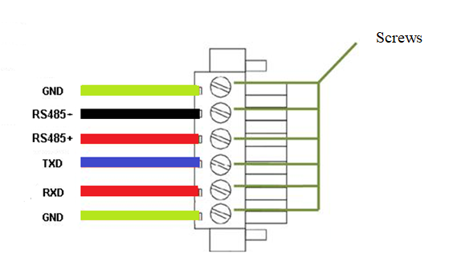
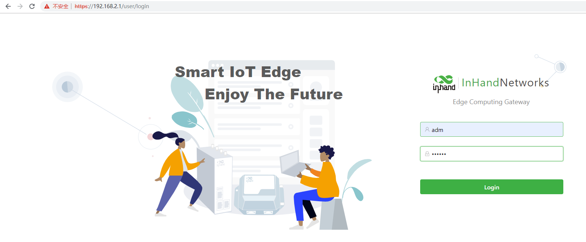
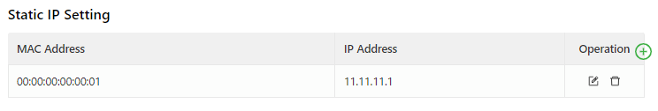
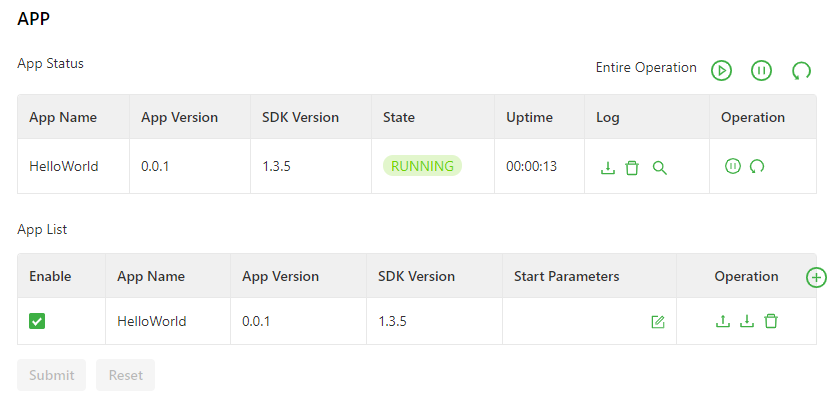
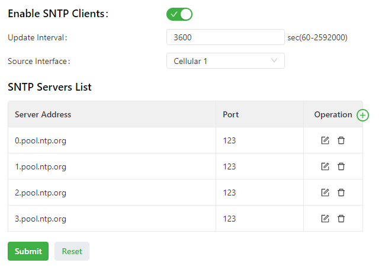
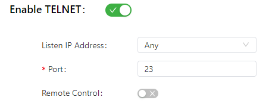
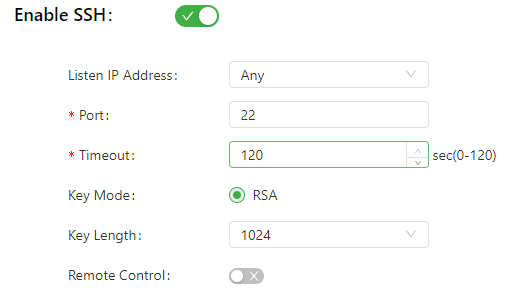
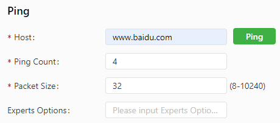
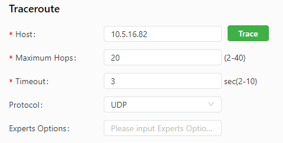
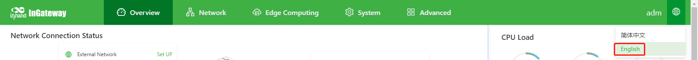

# InGateway501 User Manual

  - [1. Equipment Introduction](#equipment-introduction)
    - [1.1 Overview](#overview)
    - [1.2 Packing List](#packing-list)
    - [1.3 Panel Introduction and Structure Size](#panel-introduction-and-structure-size)
      - [1.3.1 Panel](#panel-introduction)
      - [1.3.2 Structure and Dimensions](#structure-size)
  - [2. Installation](#device-installation)
    - [2.1 Precautions](#installation-precautions)
    - [2.2 Installing and Uninstalling the Device](#installing-and-uninstalling-the-device)
      - [2.2.1 Installing](#installing)
      - [2.2.2 Uninstalling in Wall-mounted Mode](#uninstalling-in-wall-mounted-mode)
    - [2.3 Installing a SIM Card](#sim-card-installation)
    - [2.4 Installing an Antenna](#antenna-installation)
    - [2.5 Installing the Power Supply](#power-installation)
    - [2.6 Connecting the Network Cable](#network-cable-connection)
    - [2.7 Connecting Terminals](#terminal-connection)
    - [2.8 Connecting I/O](#connecting-io)
  - [3. Device Configuration Instructions](#device-configuration-instructions)
    - [3.1 Gateway Access](#access-gateway)
    - [3.2 Overview](#overview2)
    - [3.3 Network](#network)
      - [3.3.1 Network Interfaces](#network-interface)
        - [3.3.1.1 Cellular](#cellular-network)
        - [3.3.1.2 Ethernet](#ethernet)
        - [3.3.1.3 Loopback](#loopback-interface)
      - [3.3.2 Network Services](#internet-service)
        - [3.3.2.1 DHCP](#dhcp-service)
          - [3.3.2.1.1 DHCP Server](#dhcp-server)
          - [3.3.2.1.2 DHCP Relay](#dhcp-relay)
        - [3.3.2.2 DNS](#dns-service)
        - [3.3.2.3 Host List](#host-list)
      - [3.3.3 Routing](#static-routing)
        - [3.3.3.1 Routing Status](#static-routing-status)
        - [3.3.3.2 Static Routing](#static-routing-configuration)
      - [3.3.4 Firewall](#firewall)
        - [3.3.4.1 ACL](#acl)
        - [3.3.4.2 NAT](#nat)
    - [3.4 Edge Computing](#edge-computing)
      - [3.4.1 Python Edge Computing](#python-edge-computing)
    - [3.5 System](#system-management)
      - [3.5.1 System Time](#system-time)
      - [3.5.2 Log](#system-log)
      - [3.5.3 Configuration Management](#configuration-management)
      - [3.5.4 Device Manager](#equipment-remote-monitoring-platform)
      - [3.5.5 Firmware Upgrade](#firmware-upgrade)
      - [3.5.6 Access Tools](#management-tools)
      - [3.5.7 User Management](#user-management)
      - [3.5.8 Reboot](#reboot)
      - [3.5.9 Network Tools](#tools)
      - [3.5.10 3rd Party Notification](#third-party-software-statement)
    - [3.6 Navigation Bar Operations](#navigation-bar-operation)
      - [3.6.1 Returning to the Homepage](#back-to-top)
      - [3.6.2 Logging Out](#sign-out)
      - [3.6.3 Changing the Language](#switch-language)
  - [5. FAQ](#faq)
    - [5.1 How Do I Restore Factory Settings Through Hardware?](#how-to-restore-factory-settings-through-hardware)

## 1. Product Introduction

### 1.1 Overview

The InGateway501 (IG501 for short) series is a compact-sized edge computing gateway developed by InHand Networks for the Industrial IoT sector. IG501 provides omnipresent, uninterrupted Internet access over globally deployed 3G or 4G wireless networks and various broadband services. With superb edge computing capabilities and comprehensive features such as security guarantee and wireless services, IG501 is able to connect tens of thousands of devices and provide high-speed data channels for IT-based device management.
The open edge computing platform of IG501 enables it to provide data optimization, real-time response, agile connection, and intelligent analysis at the edge of the IoT. Using IG501 gateways as edge nodes can significantly reduce the data traffic between data centers and onsite devices, and prevent bottlenecks of cloud computing. In addition, IG501 optimizes the network architecture, and provides higher security, faster response, and more intelligent services.

The following figure shows common application scenarios of the IG501.

### 1.2 Packing List
Each edge computing gateway product is delivered with accessories (such as standard accessories) frequently used at the customer site. Check the received product against the packing list carefully. If any accessory is missing or damaged, contact the InHand sales personnel promptly.  
InHand provides customers with optional accessories based on the characteristics of different sites. For details, see the optional accessories list.
- Standard accessories  
  <table>
      <thead>
          <tr>
              <th>
Accessory
</th>
              <th>Quantity</th>
              <th>
Description
</th>
          </tr>
      </thead>
      <tbody>
          <tr>
              <th>
Gateway
</th>
              <th>
1
</th>
              <th>
Edge computing gateway
</th>
          </tr>
          <tr>
              <th>
Power terminal
</th>
              <th>
1
</th>
              <th>
2-pin industrial terminal
</th>
          </tr>
          <tr>
              <th>
Serial terminal
</th>
              <th>
1
</th>
              <th>
6-pin industrial terminal
</th>
          </tr>
          <tr>
              <th>
Network cable
</th>
              <th>
1
</th>
              <th>
1.5 m long
</th>
          </tr>
          <tr>
              <th>
Antenna
</th>
              <th>
1
</th>
              <th>
4G specification
</th>
          </tr>
          <tr>
              <th>
Product warranty card
</th>
              <th>
1
</th>
              <th>
Warranty period: 1 year
</th>
          </tr>
          <tr>
              <th>
Certificate of conformance
</th>
              <th>
1
</th>
              <th>
Certificate of conformance for the edge computing gateway
</th>
          </tr>
      </tbody>
  </table>   

- Optional accessories  
  <table>
      <thead>
          <tr>
              <th>
Accessory
</th>
              <th>Quantity</th>
              <th>
Description
</th>
          </tr>
      </thead>
      <tbody>
          <tr>
              <th>
AC power cord
</th>
              <th>
1
</th>
              <th>
Power cord for American English Australian or European Standard
</th>
          </tr>
          <tr>
              <th>
Power Adapter
</th>
              <th>
1
</th>
              <th>
12VDC Power Adapter
</th>
          </tr>
      </tbody>
  </table>

### 1.3 Panel introduction and Structure and Dimensions

#### 1.3.1 Panel
The panel introduction of IG501 is shown in the figure below (The IG500 series product is applicable to multiple panel appearances, as they have the same installation method. Refer to the actual product during operation.):  

#### 1.3.2 Structure and Dimensions
The structural and dimensions of IG501 are shown in the following figure:  

  

## 2. Installation

### 2.1 Precautions
- Power supply requirements: 12 V DC (9–35 V DC). Pay attention to the voltage class. The rated current is 0.6 A (1.2–0.3 A).
- Environment requirements: operating temperature –25°C to 75°C; storage temperature –40°C to 85°C; relative humidity 5% to 95% (non-condensing). The temperature on the device surface may be high. Install the device in a restricted area and assess the surrounding environment.
- Avoid direct sunlight and keep away from thermal sources or areas with strong electromagnetic interferences.
- Check whether the required cables and connectors are installed.

### 2.2 Installing and Uninstalling the Device

#### 2.2.1 Installing
Procedure:
- Step 1: Select an installation place and reserve enough space for installation.  
- Step 2: Take out the screws (The screws need to be prepared by the customer), fasten the screws in the installation positions by using the screwdriver, as shown in following figure.
  
  

#### 2.2.2 Uninstalling in Wall-mounted Mode
Procedure: Hold the device with one hand and unfasten the screws that fix the upper end of the device with the other hand, to remove the device from the installation place.  

### 2.3 Installing a SIM Card
Hold down SIM pop-up button will pop up the card holder, load the SIM card .  

### 2.4 Installing an Antenna
Revolve the movable part of the metal SMAJ interface with gentle force until it cannot be revolved, in which state the outer thread of the antenna connection cable is invisible. Do not wring the antenna with force by grabbing the black plastic cover.  

  

Note:  
- IG501 supports dual antenna: ANT antenna and AUX antenna. The ANT antenna sends and receives data. The AUX antenna only increases the antenna signal strength and cannot be used independently for data transmission.  
- Only the ANT antenna is used in normal cases. It is used with the AUX antenna only when signal is poor and signal strength must be improved.

### 2.5 Installing the Power Supply
Procedure:
- Step 1: Remove the terminal from the gateway.  
- Step 2: Unfasten the locking screw on the terminal.  
- Step 3: Connect the power cable to the terminal and fasten the locking screw.

  

### 2.6 Connecting the Network Cable
Connect the gateway to a PC directly by using the Ethernet cable.  

  

### 2.7 Connecting Terminals
Terminals provide the RS232 and RS485 interface modes. Connect cables to the corresponding terminals before using the interfaces. During installation, remove the terminals from the device, unfasten the locking screws on the terminals, connect cables to the corresponding terminals, and fasten the screws. Sort the cables in order.  

  

Note: This section is only applicable to IG500 with industrial interfaces.

### 2.8 Connecting I/O
The I/O is RJ45 port.Sort the cables in order.  
C: Common port    D: Digital inpurt

  

## 3. Device Configuration

### 3.1 Gateway Access

- Step 1: Set an IP address for your PC, which is on the same network segment as the IP address of interface FE 0/1 on the IG501. The default IP address of FE 0/1 is **192.168.1.1**.
  
  - Method 1: Enable the PC to obtain an IP address automatically (recommended).
    
    
  
  - Method 2: Use a fixed IP address.  

    Select **Use the following IP address**, enter an IP address (any value between 192.168.1.2 and 192.168.1.254 by default), subnet mask (255.255.255.0 by default), default gateway (192.168.1.1 by default), and DNS server address, and click **OK.**
    
    

- Step 2: Start the browser to visit the IP address of FE 0/1 on the IG501, and enter the user name and password on the login page that appears. The factory default user name and password of the IG501 are **adm** and **123456**, respectively.
  
  

- Step 3: After logging in, you will see the web page as shown in the following figure.
  
  

### 3.2 Overview

The **Overview** page displays information about the IG501, such as its network connection status, system information, and data usage. You can quickly obtain the IG501 running status on this page.   
After you log in to the IG501 web page, the **Overview** page appears by default. You can also click **Overview** to display this page. This page displays the following information:

- Network Connection Status: shows the IG501's network connection status and network configuration.
  
  - Cellular network status: When you click **Set UP**, the [Cellular](#cellular-network) page appears.
  - Network status of FE 0/1: When you click **Set UP**, the [Ethernet](#ethernet) page appears.
  
  

- Edge Computing: shows the status of Python edge computing.
  
  

- Data Usage Monitoring: shows the usage of data traffic in the last 24 hours. One data record is produced every hour.
  
  

- CPU Load: shows the CPU usage in the last 1 minute, 5 minutes, and 15 minutes.
  
  

- Memory: shows the current memory usage.
  
  

- System Information: You can click the Edit icon to change name of the IG501.
  
  

### 3.3 Network

#### 3.3.1 Network Interfaces

##### 3.3.1.1 Cellular

The **Cellular** page displays the configuration and status of the IG501's dial-up interface. You can set dial-up interface parameters to connect the IG501 to a cellular network or view details about the dial-up interface on this page. Follow these steps to configure the dial-up interface:

1. Choose **Network > Network Interfaces > Cellular** to display the **Cellular** page.
2. Select **Enable Cellular**.
3. Set the parameters (default settings recommended). For details about these parameters, see [cellular network parameter description](#cellular-parameter-description).
4. Click **Submit** to complete the configuration of the dial-up interface.

The cellular network parameters are described as follows:

- Enable Cellular: enables or disables the cellular network connection.
- Profile
  - Network Type: specifies the type of the mobile network to which the gateway is connected, which can be GSM or CDMA.
  - APN: specifies the access point name (APN) that identifies the service type of a WCDMA/LTE network. A WCDMA/LTE system provides services based on the APN of the connected WCDMA/LTE network. (This parameter does not need to be set for the CDMA2000 series.)
  - Access Number: specifies the dial string provided by the network operator. Obtain this dial string from your network operator.
    - If your 3G/LTE data card supports WCDMA or LTE, the default dial string is `*99***1#`.
    - If your 3G data card supports CDMA 2000, the default dial string is `#777`.
  - Auth Method
    - Auto: selects an authentication method automatically.
    - PAP: specifies the Password Authentication Protocol, a simple plain-text authentication method implemented through two-way handshakes.
    - CHAP: specifies the Challenge Handshake Authentication Protocol, a security authentication method that verifies message digests through three-way handshakes.
    - MS-CHAP: specifies the CHAP standard defined by Microsoft.
    - MS-CHAPv2: specifies the upgraded version of MS-CHAP, which requires two-way authentication.
  - Username: specifies the user name used for connection to the public data network (PDN). It is provided by your network operator. The default value is `gprs`.
  - Password: specifies the password of the PDN user. It is provided by your network operator. The default value is `gprs`.
- Network Type: specifies a network type for the SIM card. Options are Auto, 3G, 4G, and 2G. You can select a specific network type suitable for your gateway and SIM card or choose the auto mode, in which the gateway automatically registers to the suitable network.
- Profile: specifies the index of the dial-up parameter set.
- Roaming: enables the roaming function to allow the gateway to dial up in roaming state or disables the roaming function to prevent the gateway from dialing up in roaming state. When a local SIM card is used, its dial-up capability is not affected whether this option is selected or deselected.
- PIN code: specifies the personal identification number of the SIM card. If you enable PIN code but do not set a PIN code or set a wrong PIN code, the gateway cannot dial up. A valid PIN code enables the gateway to dial up to a network.
- Static IP: enables or disables the use of a static IP address. If you select this option, specify an IP address manually. Then, the gateway obtains the specified static IP address every time it dials up to a network.
- Connection Mode
  - Always Online: indicates that the gateway stays online when it is running properly and will be disconnected and redial up only if the dial-up interface does not transmit any traffic in 30 minutes. This is the default connection mode of the system.
  - On-demand Dial
    - Data Trigger: indicates that the gateway is offline by default and will dial up automatically when data is sent to the Internet.
  - Manual Dial: indicates that the network connection can be established or terminated by clicking **Connect** or **Disconnect** in the **Status** area.
- Redial Interval: specifies the period that the gateway waits before dialing up again.
- ICMP Probes
  - ICMP Detection Server: specifies the IP address or domain name of the remote ICMP server to be probed. (If two ICMP servers are enabled, it is recommended that you enter the IP addresses or domain names of both servers here.) The gateway supports two ICMP servers: a primary server and a backup server. After two servers are configured, the gateway probes the primary server first. It probes the secondary server only when the number of probe retries on the primary server reaches the maximum value. If both the servers fail to be detected, the gateway dials up again and starts a new round of ICMP probe.
  - ICMP Detection Interval: specifies the interval between ICMP probe packets sent from the gateway.
  - ICMP Detection Timeout: specifies the timeout period of an ICMP probe. If the gateway does not receive any ICMP Reply packet within this period, it considers that the ICMP probe times out.
  - ICMP Detection Max Retries: specifies the maximum number of retries after an ICMP probe failure. (The gateway dials up again when the number of retries reaches this value.)
  - ICMP Detection Strict: enables or disables the strict ICMP probe mode. In this mode, the gateway does not send ICMP probe packets when its dial-up interface is transmitting data traffic. It sends ICMP probe packets only when the dial-up interface is idle.
- Advanced Settings
  - Initial Commands: specifies some AT commands used to check the module status.
  - RSSI Poll Interval: specifies the interval at which the gateway checks the signal status after dialing up successfully. For example, the interval is set to 60s. If you remove the antennas after the gateway dials up successfully, the signal strength will remain unchanged in 60s and decrease 60s later. If the interval is set to 0, RSSI polling is disabled.
  - Dial Timeout: specifies the dial-up timeout period. If the gateway fails to dial up to a network within the timeout period, the dial-up times out. In this case, the gateway checks the module status and dials up to the network again.
  - MRU: specifies the maximum receive unit, which is expressed in bytes.
  - MTU: specifies the maximum transmit unit, which is expressed in bytes.
  - Use Default Asyncmap: enables or disables the default Asyncmap.
  - Use Peer DNS: enables or disables the use of the DNS server assigned in the connected network.
  - LCP Interval: specifies the interval at which the gateway checks whether the cellular connection is normal.
  - LCP Max Retries: specifies the maximum number of dial-up retries after the link connection is interrupted.
  - Infinitely Dial Retry: enables the gateway to retry unlimited times upon a dial-up failure.
  - Debug: enables display of more detailed system logs.
  - Expert Options: allows you to set command parameters.

##### 3.3.1.2 Ethernet

The **Ethernet** page displays the configuration and status of Ethernet interfaces on the IG501. You can set Ethernet interface parameters or view details about the Ethernet interfaces on this page. Follow these steps to configure the Ethernet interfaces:

1. Choose **Network > Network Interfaces > Ethernet** to display the **Ethernet** page.
2. Select a network type for interface FE 0/1.
3. Select options or enter values for the parameters. For details about these parameters, see [Ethernet parameter description](#ethernet-parameter-description).
4. Click **Submit** to complete the configuration of FE 0/1.

The following figure shows the configuration of FE 0/1, with **Network Type** set to **DHCP**.

The following figure shows the configuration of FE 0/1, with **Network Type** set to **Static IP**.

The Ethernet parameters are described as follows:

- Network Type (Static IP by default)
  - Static IP: uses a manually configured IP address, matching subnet mask, and other information for the Ethernet interface.
  - Dynamic Address (DHCP): configures the interface as a DHCP client to obtain an IP address, the matching subnet mask, and other information through DHCP.
- Static IP mode
  - Primary IP: specifies the IP address of the Ethernet interface. By default, the IP address of FE 0/1 is 192.168.1.1.
  - Netmask: specifies the subnet mask of the Ethernet interface.
  - MTU: specifies the maximum transmit unit, which is expressed in bytes. The default value is 1500.
  - Speed/Duplex, including:
    - Auto Negotiation
    - 100M Full Duplex
    - 100M Half Duplex
    - 10M Full Duplex
    - 10M Half Duplex
  - Track L2 State: enables or disables tracking of L2 interface status. After this feature is enabled, the interface is Down when it is not physically connected and is Up when it is physically connected. After this feature is disabled, the interface state is displayed as UP regardless of whether the interface is physically connected.
  - Shutdown: disables the interface.
  - Description: specifies the descriptive information that identifies the Ethernet interface.
  - Secondary IP Setting: allows you to set up to 10 secondary IP addresses in addition to the primary IP address.
- DHCP mode
  - Description: specifies the descriptive information that identifies the Ethernet interface.

##### 3.3.1.3 Loopback

The loopback interface is a logical, virtual interface on the IG501. After you create and configure the loopback interface, you can ping its IP address or set up a Telnet connection to it to test the network connectivity. You can set or view loopback interface parameters on the **Loopback** page. Follow these steps to configure the loopback interface:

1. Choose **Network > Network Interfaces > **Loopback**** to display the **Loopback** page. You can set or view loopback interface parameters on this page.
2. Click the Add icon in the table under **Secondary IP Setting** to add a secondary IP address for the loopback interface. (The default IP address is 127.0.0.1.)
3. Enter the secondary IP address and subnet mask.
4. Click **Submit** to complete the configuration of the loopback interface.

As shown in the following figure, a secondary IP address 127.0.0.2 is set for the loopback interface. 

Caution: You can set a maximum of 10 secondary IP addresses for the loopback interface.

#### 3.3.2 Network Services

##### 3.3.2.1 DHCP

###### 3.3.2.1.1 DHCP Server

The Dynamic Host Configuration Protocol (DHCP) uses the client/server communication model. The client sends a configuration request to the server, and the server replies with the IP address allocated to the client and other configuration information. In this way, the client IP address and other configuration is assigned dynamically. You can configure a DHCP server and view its configuration on the **DHCP Server** page. Follow these steps to configure a DHCP server:

1. Choose **Network > Network Services > DHCP > DHCP Server** to display the **DHCP Server** page.
2. Click the **Add** or **Edit** icon to configure the DHCP server.
3. Set the parameters. For details about these parameters, see [DHCP server parameter description](#dhcp-server-parameter-description).
4. Click **OK** to save the configuration, and then click **Submit** to apply the configuration.

The following figure shows the DHCP server configuration.

- The DHCP server parameters are described as follows:
  
  - Enable DHCP Service: enables or disables the DHCP service. Caution: The DHCP server and DHCP relay features cannot be enabled at the same time.
  - Interface: specifies the interface on which the DHCP service is enabled. You can select Fastethernet 0/1.
  - Starting Address: specifies the start IP address of the IP address pool for address allocation to DHCP clients.
  - Ending Address: specifies the end IP address of the IP address pool for address allocation to DHCP clients.
  - Lease: specifies the validity period of allocated IP addresses. The DHCP server will reclaim the expired IP addresses for reallocation. This field cannot be left blank.

- Windows Name Server (WINS): specifies the IP address of the WINS server.

- Static IP Setting: allows you to bind a fixed IP address to a MAC address, as shown in the following figure.
  
  

###### 3.3.2.1.2 DHCP Relay

A DHCP relay (or DHCP relay agent) can process and forward DHCP information between subnets and physical network segments. You can configure a DHCP relay and view its configuration on the **DHCP Relay** page. Follow these steps to configure a DHCP relay:

1. Choose **Network > Network Services > DHCP > DHCP Relay** to display the **DHCP **Relay**** page.
2. Enable the DHCP relay feature. Before this operation, you must disable the DHCP server.
3. Specify the DHCP server addresses and relay interface. For details about these parameters, see [DHCP relay parameter description](#dhcp-relay-parameter-description).
4. Click **Submit** to apply the configuration.

The following figure shows the DHCP relay configuration.

The DHCP relay parameters are described as follows:

- Enable DHCP Relay: enables or disables the DHCP relay feature. The DHCP relay and DHCP server features cannot be enabled at the same time.
- DHCP Server: specifies the IP address of the DHCP server.
- Relay Interface: specifies the network interface that serves as the DHCP relay.

##### 3.3.2.2 DNS

A domain name system (DNS) is a distributed database used for TCP/IP applications and provides translation between domain names and IP addresses. DNS allows users to access some applications by using easy-to-remember, meaningful domain names, which are then translated into the correct IP addresses by a DNS server on the network. You can configure a DNS server and the DNS relay service and view the configuration on the **DNS** page.

- Follow these steps to configure a DNS server:
  
  1. Choose **Network > Network Services > DNS** to display the **DNS** page.
  2. Enter the IP address of the DNS server.
  3. Click **Submit** to apply the configuration.
  
  The following figure shows the DNS server configuration.
  
  

- Follow these steps to configure the DNS relay service:
  
  1. Choose **Network > Network Services > DNS** to display the **DNS** page.
  2. Enable the DNS relay service. The DNS relay service cannot be disabled when the DHCP server feature is enabled.
  3. Click the Add icon to add a **[domain name \<=> IP address] pair**.
  4. Enter the domain name or IP address of a host and specify the matching IP address.
  5. Click **OK** to save the configuration, and then click **Submit** to apply the configuration.
  
  The following figure shows the configuration of the DNS relay service.
  
  

##### 3.3.2.3 Host List

You can view information about hosts connected to the IG501 on the **Host List** page. Choose **Network > Network Services > Host List** to display the **Host List** page, as shown in the following figure.

#### 3.3.3 Routing

##### 3.3.3.1 Routing Status

Choose **Network > Routing > Routing Status** to display the **Routing Status** page. This page displays information about static routes configured on the IG501, as shown in the following figure.

##### 3.3.3.2 Static Routing

You can configure static routes on the **Static Routing** page. Then, packets sent to a specific destination are forwarded through the specified route. (Generally, you do not need to configure static routes.) Follow these steps to configure a static route:

1. Choose **Network > Routing > Static Routing** to display the **Static Routing** page.
2. Click the **Add** icon to add a static route.
3. Set the parameters. For details about these parameters, see [static routing parameter description.](#static-routing-parameter-description)
4. Click **OK** to save the configuration, and then click **Submit** to apply the configuration.

The following figure shows the configuration of a static route.

Parameters of a static route are described as follows:

- Destination: specifies the destination IP address to which packets are sent.
- Netmask: specifies the subnet mask of the destination IP address.
- Interface: specifies the interface through which data packets are forwarded to the destination network.
- Gateway: specifies the IP address of the next router that data packets pass through before reaching the destination IP address.
- Distance: specifies the priority of the route. A smaller value indicates a higher priority.
- Track ID: specifies the track index or ID.

#### 3.3.4 Firewall

##### 3.3.4.1 ACL

An access control list (ACL) permits or denies specified data flows (such as the data flow from a specified source IP address or account) based on a series of matching rules to filter the data reaching a network interface. You can configure a data filtering policy for a network interface on the **ACL** page. The configuration procedure is as follows:

1. Choose **Network > Firewall > ACL** to display the **ACL** page.
2. Click the Add icon under **Access Control Policy** to add an access control policy.
3. Set the parameters. For details about these parameters, see [access control policy parameter description.](#access-control-strategy-parameter-description)
4. Click the Add or Edit icon under **ACL** to add an access control list on a specified interface.
5. Set the parameters. For details about these parameters, see [access control list parameter description.](#access-control-list-parameter-description)
6. Click **OK** to save the configuration, and then click **Submit** to apply the configuration.

The following figure shows the configuration of a standard access control policy.

The following figure shows the configuration of an extended access control policy.

The following figure shows the configuration of an access control list.

- Parameters of a standard access control policy are described as follows:
  
  - ID: specifies the ID of an ACL rule, in the range of 1-99. A smaller value indicates a higher priority of the rule.
  - Sequence Number: specifies the sequence number of the ACL rule. A smaller value indicates a higher priority of the rule.
  - Action: permits or denies forwarding of matching packets.
  - Source IP: specifies the source IP address of packets in the ACL rule. If this field is kept blank, the rule matches packets from all networks.
  - Source Wildcard: specifies the wildcard mask of the source IP address in the ACL rule.
  - Log: enables or disables recording of access control logs.
  - Description: records meanings of access control parameters.

- Parameters of an extended access control policy are described as follows:
  
  - ID: specifies the ID of an ACL rule, in the range of 100-199. A smaller value indicates a higher priority of the rule.
  - Sequence Number: specifies the sequence number of the ACL rule. A smaller value indicates a higher priority of the rule.
  - Action: permits or denies forwarding of matching packets.
  - Protocol: specifies the access control protocol.
  - Source IP: specifies the source IP address of packets in the ACL rule. If this field is kept blank, the rule matches packets from all networks.
  - Source Wildcard: specifies the wildcard mask of the source IP address in the ACL rule.
  - Source Port: specifies the source port number of packets. The value **any** indicates that TCP/UDP packets with any source ports match the rule. This parameter is available only when the TCP or UDP protocol is selected.
  - Destination IP: specifies the destination IP address of packets in the ACL rule. If this field is kept blank, the rule matches packets destined for all networks.
  - Destination Wildcard: specifies the wildcard mask of the destination IP address in the ACL rule.
  - Destination Port: specifies the destination port number of packets. The value **any** indicates that TCP/UDP packets with any destination ports match the rule. This parameter is available only when the TCP or UDP protocol is selected.
  - Established Connection: specifies the range of TCP packets controlled. If this option is selected, the system controls TCP packets on established connections and does not control those on unestablished connections. If this option is deselected, the system controls TCP packets on both established and unestablished connections. This parameter is available only when the TCP protocol is selected.
  - Fragments: enables or disables control of fragmented data packets sent from the interface.
  - Log: enables or disables recording of access control logs.
  - Description: records meanings of access control parameters.

- Parameters of an access control list are described as follows:
  - Interface: specifies the name of the interface on which the access control policy is configured.
  - Rule: specifies the inbound, outbound, and administrative rules.

##### 3.3.4.2 NAT

Network address translation (NAT) allows multiple hosts in a LAN to connect to the Internet by using one or multiple public IP addresses. This feature maps a few public IP addresses to many private IP addresses to conserve public IP addresses. You can view and configure NAT rules on the **NAT** page. The configuration procedure is as follows:

1. Choose **Network > Firewall > NAT** to display the **NAT** page.
2. Select an interface from the **Interface** drop-down list.
3. Click the Add icon under **Network Address Translation (NAT) Rules** to add an NAT rule and set parameters for the rule. For details about these parameters, see [NAT rule parameter description](#network-address-translation-rules-parameter-description).
4. Click **OK** to save the configuration, and then click **Submit** to apply the configuration.

As shown in the following figure, the NAT rule allows hosts connected to the IG501 to connect to the Internet by using the IP address of interface FE 0/1.

Parameters of the NAT rule are described as follows:

- Action
  - SNAT: uses the source network address translation feature that translates source IP addresses of data packets into another IP address. Generally, this feature is used for data packets sent to the Internet through the router.
  - DNAT: uses the destination network address translation feature that translates destination IP addresses of data packets into another IP address. Generally, this feature is used for data packets sent to the private network through the router.
  - 1:1NAT: uses one-to-one IP address translation.
- Source Network (available when the action is set to SNAT or DNAT):
  - Inside: translates private IP addresses.
  - Outside: translates public IP addresses.
- Translation Type, which can be:
  - IP to IP
  - IP to INTERFACE
  - IP PORT to IP PORT
  - ACL to INTERFACE
  - ACL to IP
- Access Control List (unavailable for 1:1 NAT): specifies the ACL rule used to match the packets of which the IP addresses are translated.
- Translated Address (unavailable for 1:1 NAT): specifies the IP address or interface translated from the source address.
- Description: specifies the description of the NAT rule.

### 3.4 Edge Computing

#### 3.4.1 Python Edge Computing

The **Python Edge Computing** page displays information about the Python secondary development environment on the IG501, as well as the configuration and running status of Python apps on the IG501. You can use the secondary development environment to develop custom Python apps, and set or view app status.   
Follow these steps to configure the Python secondary development environment:

1. Choose **Edge Computing > **Python Edge Computing**** to display the **Python Edge Computing** page.
2. Enable the Python edge computing engine.
3. Install or upgrade the Python SDK (optional).
4. Enable the debugging mode. For details about Python secondary development, see [Python Development Quick Start](http://sdk.ig.inhandnetworks.com/en/latest/MobiusPi-Python-QuickStart-EN.html).

Follow these steps to configure a Python app:

1. Choose **Edge Computing > **Python Edge Computing**** to display the **Python Edge Computing** page.
2. Enable the Python edge computing engine.
3. Install or upgrade the Python SDK (optional).
4. In the **Configure** area, import the app package and select **Enable.** For details about the configuration, see [app configuration function description](#app-configuration-function-description).
5. Click **Submit** to apply the configuration.

The following figure shows the configuration of the Python development environment on the IG501.

The following figure shows the app running status (HelloWorld as an example).

The app configuration functions are described as follows:

- App status
  - Start all: starts all the enabled apps.
  - Stop all: stops all the enabled apps.
  - Restart all: restarts all the enabled apps.
  - Download: downloads running logs of a specified app.
  - Delete: deletes all running logs of a specified app.
  - View: displays running logs of a specified app.
  - Stop: stops a specified app.
  - Restart: restarts a specified app.
- App List
  - Enable: enables an app so that it will run automatically after each system reboot.
  - Start Parameters: allows you to configure app start parameters here.
  - Export: allows you to export an app configuration file.
  - Import: allows you to import an app configuration file. After you import a configuration file and restart the app, the app runs with the imported configuration file.
  - Unload: allows you to unload an app.
  - Add: allows you to add an app.

### 3.5 System

#### 3.5.1 System Time

To enable the IG501 to cooperate with other devices properly, you may need to set an accurate system time for it. For this purpose, set the system time on the **System Time** page and enable the NTP protocol to implement clock synchronization among all clock-supporting devices on the network. In this way, all devices maintain the same clock to provide applications based on the consistent time. Follow these steps to set the system time:

- Method 1: Select a time zone.
  1. Choose **System > System Time** to display the **System Time** page.
  2. Select the time zone where the IG501 is located from the **Time Zone** drop-down list.
  3. Click **Apply**.
- Method 2: Set the system time manually.
  1. Choose **System > System Time** to display the **System Time** page.
  2. Set a specific time in the Set Time field.
  3. Click **Apply**.
- Method 3: Use the local time of the PC.
  1. Choose **System > System Time** to display the **System Time** page.
  2. The IG501 can obtain the time of the PC as its local time.
  3. Click **Sync** next to the Device Time field.
- Method 4: Enable SNTP clients.
  1. Choose **System > System Time** to display the **System Time** page.
  2. Select **Enable SNTP Clients**.
  3. Set the parameters. For details about these parameters, see [SNTP client parameter description.](#sntp-client-parameter-description)
  4. Click **Submit** to apply the configuration.

Follow these steps to enable the NTP server to synchronize time to other devices.

1. Choose **System > System Time** to display the **System Time** page.
2. Select **Enable SNTP Server**.
3. Set the parameters. For details about these parameters, see [NTP server parameter description](#ntp-server-parameter-description).
4. Click **Submit** to apply the configuration.

The following figure shows how to select a time zone or set a system time manually.

The following figure shows how to enable SNTP clients.

The following figure shows how to enable the NTP server to synchronize time to other devices.

SNTP client parameters are described as follows:

- Enable SNTP Clients: enables or disables SNTP clients. If the cellular interface is selected as the source interface, the SNTP service will not be enabled when the gateway fails to dial up to a network.
- Update Interval: specifies the interval at which the SNTP clients synchronize time with the IG501.
- Source Interface: specifies the interface through which the IG501 sends SNTP packets. The source interface and source address cannot be used at the same time.
- Source Address: specifies the source address of the SNTP packets sent from the IG501. The source interface and source address cannot be used at the same time.
- SNTP Servers List
  - Server Address: specifies the domain name or IP address of an SNTP server. You can add a maximum of 10 servers to the list. If you set multiple SNTP servers, the system polls all the SNTP servers to find an available one.
  - Port: specifies the SNTP port number used by an SNTP server.

The NTP server parameters are described as follows:

- Enable NTP Server: enables or disables the NTP server feature.
- Update Interval: specifies the time synchronization interval. The NTP protocol uses the multi-stratum synchronization model. Generally, stratum-n+1 clocks synchronize with a stratum-n clock source. NTP supports synchronization of up to 16 strata of clocks, namely, stratum 0 to stratum 15. Synchronization cannot be implemented for more than 16 strata of clocks.
- Source Interface: specifies the interface through which the IG501 sends NTP packets. The source interface and source address cannot be used at the same time.
- Source Address: specifies the source address of the SNTP packets sent from the IG501. The source interface and source address cannot be used at the same time.
- NTP Servers List
  - Primary NTP Server: specifies the primary NTP server from which the IG501 synchronizes time. If you select multiple primary NTP servers, the IG501 polls all the selected servers to find an available one.
  - Server Address: specifies the domain name or IP address of an NTP server. You can add a maximum of 10 servers to the list.

#### 3.5.2 System Logs

Choose **System > Log** to display the **Log** page. This page displays a large amount of information about the network and IG501, such as its running status and changes of configuration. On the **Configure** page, you can set a remote log server. Then, the IG501 will synchronize all system logs to the remote log server. The host used as the remote log server must run a remote log program (for example, `Kiwi Syslog Daemon`).

#### 3.5.3 Configuration Management

Choose **System > Configuration Management** to display the **Configuration Management** page. On this page, you can back up configuration parameters, import parameter settings, and restore factory settings of the IG501. These functions are described as follows:

- Configuration Management
  - Auto Save: enables or disables automatic saving of modified configuration in the startup configuration file.
  - Encrypted: enables or disables password encryption. After this option is selected, all passwords configured on the IG501 web system are displayed in encrypted text. This feature improves the security of passwords.
- Configuration Files Operations
  - Import Startup Config: allows you to import a configuration file as the startup configuration of the IG501. The IG501 will load the imported configuration file upon a reboot. Ensure the validity and correct order of commands in the imported configuration file. The IG501 filters out invalid commands in the imported configuration file, and then saves the valid commands as the startup configuration. The system will execute these commands sequentially after a reboot. If commands in the imported configuration file are not listed in a valid order, the system cannot enter the expected state after a reboot.
  - Export Startup Config: allows you to back up the startup configuration on a host. The startup configuration is the configuration that the IG501 loads after it starts.
  - Export Running Config: allows you to back up the running configuration on a host. The running configuration is the configuration that the IG501 is running.
  - Restore Factory Configuration: allows you to restore the factory settings of the IG501. This operation restores all parameters on the IG501 to the default settings. The factory settings are restored after a reboot of the IG501.

#### 3.5.4 Device Manager

The Device Manager developed by InHand Networks allows you to monitor the status of IG501 gateways, maintain on-site devices remotely, configure and upgrade a batch of IG501 gateways at the same time remotely, and perform other management operations to manage IG501 gateways and on-site devices more conveniently and efficiently. You can connect an IG501 to the Device Manager on the **Device Manager** page to use the functions and services of the platform. Follow these steps to connect to the Device Manager:

1. Choose **System > Device Manager** to display the **Device Manager** page.
2. Select **Enable **Device Manager****.
3. Set the parameters. For details about these parameters, see [device manager parameter description.](#equipment-remote-monitoring-platform-parameter-description)
4. Click **Submit** to apply the configuration.

The following figure shows the configuration that connects the IG501 to the `iot.inhandnetworks.com` (DM) platform.

Parameters of the Device Manager are described as follows:

- Enable Device Manager: enables or disables the DM platform.
- Server Address: specifies the server address of the DM platform to be connected.
- Registered Account: specifies an account registered on the DM platform.
- Advanced Settings
  - Site Name: specifies the site name of the IG501 on the DM platform server.
  - Asset Numbers: specifies the asset number of the IG501 on the DM platform server.
  - Location Type: specifies the source of the location information. Options are Cellular and GPS.
  - LBS Information Upload: specifies the interval for reporting LBS information. The valid value range is 60-86400.
  - Interval: specifies the interval between heartbeat packets exchanged with the DM platform. The valid value range is 30-86400.
  - Dataflow Upload Interval: specifies the interval for reporting traffic information. The valid value range is 3600-86400.

#### 3.5.5 Firmware Upgrade

You can upgrade the firmware version for the IG501 on the **Firmware Upgrade** page, so that the IG501 can provide new functions or better user experiences. Follow these steps to upgrade the firmware version:

1. Choose **System > Firmware Upgrade** to display the **Firmware Upgrade** page.
2. Click **Select File** to select a firmware file for the IG501.
3. Click **Starting Upgrade** and **OK** to start the firmware upgrade.
4. Wait until the upgrade succeeds, and then click **Reboot** to restart the IG501.

#### 3.5.6 Access Tools

To facilitate IG501 management and configuration, you can configure the IG501 management and access methods on the **Access Tools** page. Follow these steps to complete the configuration:

- Configure HTTPS
  1. Choose **System > Access Tools** to display the **Access Tools** page.
  2. Select **Enable HTTPS** and set the parameters. For details about these parameters, see [HTTPS parameter description](#https-parameter-description).
  3. Click **Submit** to apply the configuration.
- Configure Telnet
  1. Choose **System > Access Tools** to display the **Access Tools** page.
  2. Select **Enable TELNET** and set the parameters. For details about these parameters, see [Telnet parameter description](#telnet-parameter-description).
  3. Click **Submit** to apply the configuration.
- Configure SSH
  1. Choose **System > Access Tools** to display the **Access Tools** page.
  2. Select **Enable SSH** and set the parameters. For details about these parameters, see [SSH parameter description](#ssh-parameter-description).
  3. Click **Submit** to apply the configuration.

The following figure shows the configuration of HTTPS-based management.

The following figure shows the configuration of Telnet-based management.

The following figure shows the configuration of SSH-based management.

The HTTPS parameters are described as follows:

1. Listen IP Address: specifies the listening IP address. Options include Any, 127.0.0.1, and other IP addresses.
2. Port: specifies the listening port number of HTTPS.
3. Web Login Timeout: specifies the timeout period of web page login. The valid value range is 0-3600.
4. Remote Control: enables or disables remote access to the IG501 through HTTPS. If no remote control network is specified, the IG501 can be remotely controlled through any network.

The Telnet parameters are described as follows:

1. Listen IP Address: specifies the listening IP address. Options include Any, 127.0.0.1, and other IP addresses.
2. Port: specifies the listening port number of Telnet.
3. Remote Control: enables or disables remote access to the IG501 through Telnet. If no remote control network is specified, the IG501 can be remotely controlled through any network.

The SSH parameters are described as follows:

1. Listen IP Address: specifies the listening IP address. Options include Any, 127.0.0.1, and other IP addresses.
2. Port: specifies the listening port number of SSH.
3. Timeout: specifies the SSH timeout period. The valid value range is 0-120.
4. Key Mode: fixed as RSA.
5. Key Length: specifies the length of the key used. Options are 512, 1024, 2048, and 4096.
6. Remote Control: enables or disables remote access to the IG501 through Telnet. If no remote control network is specified, the IG501 can be remotely controlled through any network.

#### 3.5.7 User Management

On the **User Management** page, you can add user accounts and manage the password and access rights of each account. These accounts allow multiple users to access and manage the IG501. Follow these steps to add a user:

1. Choose **System > User Management** to display the ****User Management**** page.
2. Click the **Add** icon to add a user.
3. Set the parameters.
4. Click **OK** to save the configuration.

#### 3.5.8 Reboot

Choose **System > Reboot** to display the ****Reboot**** page, and then reboot the IG501 or set a scheduled reboot plan for it.   
As shown in the following figure, the IG501 is configured to reboot on 0:00 every day.

#### 3.5.9 Network Tools

Choose **System > Network Tools** to display the **Network Tools** page. You can diagnose network problems of the IG501 on this page. You can enter some extension options in the Expert Options area. For example, expert option -t for the ping tool enables the IG501 to ping a specified host continuously until you stop the ping.   
The ping tool can be used to check whether a network is reachable. The following figure shows the configuration of a ping test.

The traceroute tool can be used to determine the route used to transmit IP datagrams to a destination. The following figure shows the configuration of a traceroute test.

The Tcpdump tool can be used to capture packets transmitted on a specified interface. The following figure shows the Tcpdump configuration.

#### 3.5.10 3rd Party Notification

Choose **System > 3rd Party Notification** to display the **3rd Party Notification** page. You can view the statement about the third-party software used for the IG501.

### 3.6 Navigation Bar Operations

#### 3.6.1 Returning to the Homepage

You can click the InGateway logo in the upper left corner of any web page of the IG501 to return to the **Overview** page quickly.

#### 3.6.2 Logging Out

To log out from the IG501, click the user name in the upper right corner.

#### 3.6.3 Changing the Language

You can click the globe icon in the upper right corner to change the language of web pages. The IG501 supports simplified Chinese and English.

## 5. FAQ

### 5.1 How Do I Restore Factory Settings Through Hardware?

Follow these steps:

1. Find the RESET key on the operation panel.
2. Hold down the RESET key within 10s after the device is powered on.
3. When the WARN indicator turns red, release the RESET key.
4. When the WARN indicator turns off, hold down the RESET key for 1s and release it.
5. When you see the WARN indicator blink three times and turn off, the factory settings of the device have been restored.